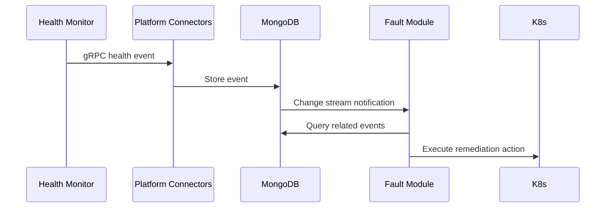

# NVSentinel Development Guide

This guide covers project structure, development workflows, and best practices for contributing to NVSentinel.

## 📋 Table of Contents

- [Getting Started](#-getting-started)
- [Project Architecture](#-project-architecture)
- [Development Environment Setup](#-development-environment-setup)
- [Development Workflows](#-development-workflows)
- [Module Development](#-module-development)
- [Testing](#-testing)
- [Code Standards](#-code-standards)
- [CI/CD Pipeline](#-cicd-pipeline)
- [Debugging](#-debugging)
- [Makefile Reference](#-makefile-reference)

## 🚀 Getting Started

### Quick Setup

```bash
git clone https://github.com/nvidia/nvsentinel.git
cd nvsentinel
make dev-env-setup  # Install all dependencies
```

### Tool Version Management

NVSentinel uses `.versions.yaml` for centralized version management across:
- Local development
- CI/CD pipelines
- Container builds

**View current versions**:
```bash
make show-versions
```

### Prerequisites

**Core Tools** (required):
- [Go 1.25+](https://golang.org/dl/) - See `.versions.yaml` for exact version
- [Docker](https://docs.docker.com/get-docker/)
- [kubectl](https://kubernetes.io/docs/tasks/tools/install-kubectl/)
- [Helm 3.0+](https://helm.sh/docs/intro/install/)
- [Protocol Buffers Compiler](https://grpc.io/docs/protoc-installation/)
- [yq](https://github.com/mikefarah/yq) - YAML processor for version management

**Development Tools**:
- [golangci-lint](https://golangci-lint.run/usage/install/)
- [gotestsum](https://github.com/gotestyourself/gotestsum)
- [gocover-cobertura](https://github.com/boumenot/gocover-cobertura)
- [addlicense](https://github.com/google/addlicense)
- [Poetry](https://python-poetry.org/)
- [shellcheck](https://github.com/koalaman/shellcheck)

**Optional** (for local Kubernetes development):
- [Tilt](https://tilt.dev/)
- [ctlptl](https://github.com/tilt-dev/ctlptl)
- [Kind](https://kind.sigs.k8s.io/)
- [MongoDB Compass](https://www.mongodb.com/products/compass)

**Quick install** (installs and configures all tools):
```bash
make dev-env-setup
```

This will:
- Detect your OS (Linux/macOS) and architecture
- Install yq and check for required tools
- Install development and Go tools
- Configure Python gRPC tools

### Build System

**Unified build system** features:
- **Consistent interface**: All modules support common targets (`all`, `lint-test`, `clean`)
- **Technology-aware**: Appropriate tooling for Go, Python, and shell scripts
- **Delegation pattern**: Top-level Makefiles delegate to individual modules
- **Repo-root context**: Docker builds use consistent paths
- **Multi-platform support**: Built-in `linux/arm64,linux/amd64` via Docker buildx

## 🏗️ Project Architecture

NVSentinel follows a **microservices architecture** with event-driven communication:

### Core Principles

1. **Independence**: Modules operate autonomously
2. **Event-Driven**: Communication through MongoDB change streams
3. **Modular**: Pluggable health monitors
4. **Cloud-Native**: Kubernetes-first design

### Module Types

```
nvsentinel/
├── health-monitors/           # Hardware/software fault detection
│   ├── gpu-health-monitor/   # Python - DCGM GPU monitoring
│   ├── syslog-health-monitor/   # Go - System log monitoring
│   └── csp-health-monitor/      # Go - Cloud provider monitoring
├── platform-connectors/      # gRPC event ingestion service
├── fault-quarantine/   # CEL-based event quarantine logic
├── fault-remediation/   # Kubernetes controller for remediation
├── health-events-analyzer/    # Event analysis and correlation
├── health-event-client/       # Event streaming client
├── labeler/           # Node labeling controller
├── node-drainer/      # Graceful workload eviction
├── store-client/         # MongoDB interaction library (tested in CI)
└── log-collector/ # Log aggregation (shell scripts)
```

### Communication Flow



## 🛠️ Development Environment Setup

### 1. Local Development with Tilt

Tilt provides the fastest development experience with hot reloading.

```bash
# Quick start - create cluster and start Tilt in one command
make dev-env                    # Creates cluster and starts Tilt

# Manual step-by-step approach
make cluster-create             # Creates ctlptl-managed Kind cluster with registry
make tilt-up                    # Starts Tilt with UI (runs: tilt up -f tilt/Tiltfile)

# Check status
make cluster-status             # Check cluster and registry status

# View Tilt UI
# Navigate to http://localhost:10350

# Stop everything when done
make dev-env-clean             # Stops Tilt and deletes cluster

# Or stop individually
make tilt-down                 # Stops Tilt (runs: tilt down -f tilt/Tiltfile)
make cluster-delete            # Deletes the cluster
```

**ctlptl Cluster Features:**

- Declarative cluster configuration with YAML
- Multi-node Kind cluster (3 control-plane, 2 worker nodes)
- Cluster name: `kind-nvsentinel` (required `kind-` prefix)
- Integrated local container registry at `localhost:5001`
- Automatic registry configuration for Tilt
- Simplified cluster lifecycle management
- No external dependencies beyond Docker, ctlptl, and Kind

### 2. Manual Development Setup

For module-specific development without full cluster:

```bash
# Set up Go environment
export GOPATH=$(go env GOPATH)
export GO_CACHE_DIR=$(go env GOCACHE)

# Install development dependencies
go install github.com/golangci/golangci-lint/v2/cmd/golangci-lint@latest
go install gotest.tools/gotestsum@latest
go install github.com/boumenot/gocover-cobertura@latest

# For controller modules
go install sigs.k8s.io/controller-runtime/tools/setup-envtest@latest
```

### 3. Go Module Configuration

Go module dependencies are handled automatically:

```bash
# Dependencies managed via go.mod files with replace directives for local development
# No manual GOPRIVATE configuration needed
# Private repository authentication handled via SSH keys
```

## 🔄 Development Workflows

### Daily Development Workflow

1. **Start Development Session**
   ```bash
   git checkout main
   git pull origin main
   git checkout -b feature/your-feature-name

   # Start local development environment
   make dev-env  # Creates ctlptl-managed cluster and starts Tilt
   ```

2. **Develop with Live Reload**
   ```bash
   # Edit code - Tilt automatically rebuilds and redeploys
   vim health-monitors/syslog-health-monitor/pkg/monitor/monitor.go

   # View logs in Tilt UI at http://localhost:10350
   # Or use kubectl for specific logs (note: syslog-health-monitor runs as DaemonSet with -regular and -kata variants)
   kubectl logs -f daemonset/nvsentinel-syslog-health-monitor-regular -n nvsentinel
   ```

3. **Test Changes**
   ```bash
   # Run tests locally (while Tilt is running)
   make health-monitors-lint-test-all              # All health monitors
   make health-events-analyzer-lint-test           # Specific Go module
   make platform-connectors-lint-test             # Another Go module

   # Or run individual module tests directly (using standardized targets)
   make -C health-monitors/syslog-health-monitor lint-test
   make -C platform-connectors lint-test
   make -C health-events-analyzer lint-test

   # Test integration with other services via Tilt UI
   # Access services via port-forwards set up by Tilt
   ```

4. **Validate Before Commit**
   ```bash
   # Run full test suite
   make lint-test-all

   # Stop Tilt for final testing if needed
   make tilt-down
   ```

5. **Commit and Push**
   ```bash
   git add .
   git commit -s -m "feat: add new monitoring capability"
   git push origin feature/your-feature-name

   # Clean up development environment
   make dev-env-clean
   ```

### Protocol Buffer Development

When modifying `.proto` files:

```bash
# Generate protobuf files
make protos-lint

# This runs:
# - protoc generation for Go modules
# - Python protobuf generation for GPU monitor
# - Import path fixes for Python
# - Git diff check to ensure files are up to date
```

### Container Development

The project provides a **unified Docker build system** with consistent patterns across all modules. All builds support multi-platform architecture, build caching, and proper context management.

#### Environment Variables

Set these for production-like builds:

```bash
# Docker configuration (standardized across all modules)
export CONTAINER_REGISTRY="ghcr.io"
export CONTAINER_ORG="your-github-username"  # Defaults to repository owner
export CI_COMMIT_REF_NAME="feature-branch"  # Or your branch name

# These are computed automatically by common.mk:
# SAFE_REF_NAME=$(echo $CI_COMMIT_REF_NAME | sed 's/\//-/g')
# PLATFORMS="linux/arm64,linux/amd64"
# MODULE_NAME=$(basename $(CURDIR))
```

#### Docker Build Commands

**Build System Overview**

The Docker build system uses shared patterns via `common.mk` for Go modules, with specialized handling for Python and container-only modules. Each module maintains its own Docker configuration.

**Main build targets (delegated to individual modules):**

```bash
# Local Development (--load) - builds images into local Docker daemon
make docker-all                       # All images locally (delegates to docker/Makefile)
make docker-health-monitors           # All health monitor images locally
make docker-main-modules              # All non-health-monitor images locally

# CI/Production (--push) - builds and pushes directly to registry
make docker-publish-all               # Build and push all images to registry
make docker-publish-health-monitors   # Build and push health monitor images
make docker-publish-main-modules      # Build and push main module images

# Individual module targets (via common.mk)
make docker-syslog-health-monitor        # Build syslog health monitor locally
make docker-publish-syslog-health-monitor # Build and push to registry
make docker-platform-connectors          # Build platform connectors locally
make docker-publish-platform-connectors  # Build and push to registry

# Special cases
make docker-gpu-health-monitor            # Both DCGM 3.x and 4.x versions locally
make docker-log-collector                 # Container-only module (shell + Python)
```

**Direct docker/ Makefile usage:**

```bash
cd docker

# Local development builds (--load)
make build-all                    # Build all 12 images locally
make build-health-monitors        # Build health monitor group locally
make build-syslog-health-monitor     # Build specific module locally

# CI/production builds (--push)
make publish-all                  # Build and push all images to registry
make publish-syslog-health-monitor   # Build and push specific image to registry

# Utility commands
make setup-buildx                 # Setup multi-platform builder
make clean                        # Remove all nvsentinel images
make list                         # List built nvsentinel images
make help                         # Show all available targets
```

**Individual module usage:**

```bash
# Go modules (common.mk patterns)
make -C health-monitors/syslog-health-monitor docker-build       # Local build with remote cache
make -C health-monitors/syslog-health-monitor docker-build-local # Local build, no remote cache (faster)
make -C health-monitors/syslog-health-monitor docker-publish     # CI build
make -C platform-connectors docker-build                        # Local build with remote cache
make -C platform-connectors docker-build-local                  # Local build, no remote cache (faster)
make -C platform-connectors docker-publish                      # CI build
make -C health-events-analyzer docker-build-local               # Local build, no remote cache (faster)
make -C health-events-analyzer docker-publish                   # CI build

# Python module (specialized patterns)
make -C health-monitors/gpu-health-monitor docker-build-dcgm3  # DCGM 3.x local
make -C health-monitors/gpu-health-monitor docker-publish-dcgm4 # DCGM 4.x CI

# Container-only module (shell + Python)
make -C log-collector docker-build-log-collector   # Local build
make -C log-collector docker-publish-log-collector # CI build
```

#### Module-Level Docker Builds

Each module provides Docker targets with common patterns:

```bash
# Go modules (common.mk patterns)
make -C health-monitors/syslog-health-monitor docker-build       # Local with remote cache
make -C health-monitors/syslog-health-monitor docker-build-local # Local, no remote cache (recommended)
make -C health-monitors/syslog-health-monitor docker-publish     # CI/production
make -C platform-connectors docker-build                        # Local with remote cache
make -C platform-connectors docker-build-local                  # Local, no remote cache (recommended)
make -C platform-connectors docker-publish                      # CI/production

# Python module (specialized patterns)
make -C health-monitors/gpu-health-monitor docker-build-dcgm3  # DCGM 3.x local
make -C health-monitors/gpu-health-monitor docker-build-dcgm4  # DCGM 4.x local
make -C health-monitors/gpu-health-monitor docker-publish     # Push both versions

# Container-only module (shell + Python)
make -C log-collector docker-build                 # Both log-collector and file-server-cleanup
make -C log-collector docker-publish               # Push both components

# Legacy compatibility (all modules)
make -C [module] image      # Calls docker-build
make -C [module] publish    # Calls docker-publish
```

#### Docker Build Features

All builds support consistent features:

1. **Multi-Platform Support**: `linux/arm64,linux/amd64` via `common.mk` (`docker-build`); `linux/amd64` for `docker-build-local`
2. **Build Caching**: Registry-based build cache for faster builds (`docker-build`); local cache only (`docker-build-local`)
3. **Repo-Root Context**: All builds use consistent repo-root context
4. **Dynamic Tagging**: Uses branch/tag name (`${SAFE_REF_NAME}`) for `docker-build`; simple `module:local` for `docker-build-local`
5. **Registry Integration**: NVCR.io registry paths for `docker-build` and `docker-publish`
6. **Module Auto-Detection**: Automatic module name detection via `$(MODULE_NAME)`

**For Local Development**, use `docker-build-local` to avoid registry authentication issues and build faster.

#### Example Build Scenarios

**Local Development:**
```bash
# Recommended: Fast local build (single platform, no remote cache)
make -C health-monitors/syslog-health-monitor docker-build-local

# Alternative: Local build with remote cache (multi-platform, slower)
make -C health-monitors/syslog-health-monitor docker-build

# Legacy: Quick local build
make -C health-monitors/syslog-health-monitor image
```

**CI-like Build:**
```bash
**CI-like Build:**
```bash
# Set up environment like GitHub Actions
export CONTAINER_REGISTRY="ghcr.io"
export CONTAINER_ORG="your-github-username"
export CI_COMMIT_REF_NAME="main"

# Build all images with full CI features (standardized)
make docker-all

# Images will be tagged like:
# ghcr.io/your-github-username/syslog-health-monitor:main
# ghcr.io/nvidia/nvsentinel/gpu-health-monitor:main-dcgm-3.x
# ghcr.io/nvidia/nvsentinel/gpu-health-monitor:main-dcgm-4.x
```

**Testing Specific Module:**
```bash
# Recommended: Build and test individual module (fast, local)
make -C platform-connectors docker-build-local
docker run --rm platform-connectors:local --help

# Alternative: Build with full CI features
make docker-platform-connectors
docker run --rm ghcr.io/nvidia/nvsentinel/platform-connectors:fix-make-file-targets --help

# Build private repo module (fast, local)
make -C health-events-analyzer docker-build-local
```

#### Build Cache Benefits

The new system uses Docker BuildKit registry cache:
- **First build**: Downloads and caches layers
- **Subsequent builds**: Reuses cached layers for 10x+ speed improvement
- **Multi-developer**: Cache shared across team via registry

#### Troubleshooting Docker Builds

**Build failures:**
```bash
# Check buildx setup
make -C docker setup-buildx

# Clean and retry
make -C docker clean
docker system prune -f
make docker-syslog-health-monitor
```

**Private repo access:**
```bash
# Verify SSH key access
git ls-remote git@github.com:dgxcloud/mk8s/some-private-repo.git

# Build with debug output
BUILDKIT_PROGRESS=plain make docker-csp-health-monitor
```

**Registry issues:**
```bash
# Test registry login
docker login nvcr.io -u '$oauthtoken' -p "$NGC_PASSWORD"

# Check image tags
make -C docker list
```

#### macOS/Docker Desktop Socket Directory Requirements

**Problem:** On macOS with Docker Desktop, Unix domain sockets require the `/var/run` directory to exist inside containers, but this directory is not created by default in minimal container images.

**Symptoms:**
- Services fail to start with errors like: `failed to listen on unix socket /var/run/nvsentinel.sock: no such file or directory`
- Tilt-based tests fail on macOS but pass on Linux
- gRPC Unix socket connections fail

**Solution:** The project includes a Tilt-specific Helm values file that creates the `/var/run` directory using an initContainer:

```yaml
# File: distros/kubernetes/nvsentinel/values-tilt-socket.yaml
#
# This values file is automatically included when running Tilt on macOS/Docker Desktop.
# It adds an initContainer to create /var/run directory for Unix socket communication.

global:
  initContainers:
    - name: create-run-dir
      image: busybox:latest
      command: ['sh', '-c', 'mkdir -p /var/run']
      volumeMounts:
        - name: socket-dir
          mountPath: /var/run
```

**How it works:**
1. The `tilt/Tiltfile` automatically includes `values-tilt-socket.yaml` for local development
2. The initContainer runs before each service starts and creates the `/var/run` directory
3. Services can then create Unix sockets at `/var/run/nvsentinel.sock`
4. The socket directory is shared via an `emptyDir` volume mount

**Platform-specific behavior:**
- **macOS/Docker Desktop:** Requires the initContainer workaround (automatically applied in Tilt)
- **Linux:** The `/var/run` directory typically exists in the container runtime environment
- **Production/Kubernetes:** Uses standard Helm values without the initContainer (not needed)

**Note:** This is a development-only workaround for local macOS environments. Production deployments on Linux do not require this configuration.

## 🧩 Module Development

### Creating a New Health Monitor

1. **Create Module Structure**
   ```bash
   mkdir -p health-monitors/my-monitor/{cmd,pkg,internal}
   cd health-monitors/my-monitor
   ```

2. **Initialize Go Module**
   ```bash
   go mod init github.com/nvidia/nvsentinel/health-monitors/my-monitor
   ```

3. **Create Module Makefile**
   ```bash
   # Copy template from existing health monitor
   cp ../syslog-health-monitor/Makefile ./Makefile

   # Update module-specific settings
   sed -i 's/syslog-health-monitor/my-monitor/g' Makefile
   sed -i 's/Syslog Health Monitor/My Monitor/g' Makefile
   ```

4. **Implement gRPC Client**
   ```go
   // pkg/monitor/monitor.go
   package monitor

   import (
       "context"
       pb "github.com/nvidia/nvsentinel/platform-connectors/pkg/protos"
       "google.golang.org/grpc"
   )

   type Monitor struct {
       client pb.PlatformConnectorClient
   }

   func (m *Monitor) SendEvent(ctx context.Context, event *pb.HealthEvent) error {
       _, err := m.client.SendHealthEvent(ctx, event)
       return err
   }
   ```

5. **Update health-monitors/Makefile**
   ```bash
   # Add your module to the health monitors list
   # Edit health-monitors/Makefile:
   # - Add 'my-monitor' to GO_HEALTH_MONITORS list
   # - Add lint-test delegation target
   # - Add build delegation target
   # - Add clean delegation target
   ```

6. **Test Your Module**
   ```bash
   # Test the individual module
   make -C health-monitors/my-monitor lint-test

   # Test via health-monitors coordination
   make -C health-monitors lint-test-my-monitor

   # Test via main Makefile delegation
   make health-monitors-lint-test-all
   ```

7. **Add to CI Pipeline**
   The module will automatically be included in GitHub Actions workflows due to the standardized patterns.

### Creating a New Core Module

1. **Follow Kubernetes Controller Pattern**
   ```bash
   # Use controller-runtime for Kubernetes controllers
   go get sigs.k8s.io/controller-runtime
   ```

2. **Implement MongoDB Change Streams**
   ```go
   // Use store-client for MongoDB operations
   import "github.com/nvidia/nvsentinel/store-client/pkg/client"
   ```

3. **Add Proper RBAC**
   Create Kubernetes RBAC manifests in `distros/kubernetes/nvsentinel/templates/`.

## 🧪 Testing

### Test Strategy

- **Unit Tests**: Test individual functions and methods
- **Integration Tests**: Test module interactions
- **End-to-End Tests**: Test complete workflows via CI

### Running Tests

The unified Makefile structure provides consistent testing across all modules:

```bash
# Test all modules (delegates to all sub-Makefiles)
make lint-test-all                          # Main Makefile - runs everything

# Test by category
make health-monitors-lint-test-all          # All health monitors
make go-lint-test-all                       # All Go modules (common.mk patterns)

# Test individual modules via delegation (main Makefile)
make health-events-analyzer-lint-test       # Go module
make platform-connectors-lint-test         # Go module
make store-client-lint-test             # Go module
make log-collector-lint-test                # Container module

# Test individual modules directly (common.mk patterns)
make -C health-monitors/syslog-health-monitor lint-test  # Go module
make -C platform-connectors lint-test                   # Go module
make -C health-events-analyzer lint-test                # Go module
make -C health-monitors/gpu-health-monitor lint-test    # Python module

# Use individual targets for development (common.mk)
cd health-monitors/syslog-health-monitor
make vet        # Just go vet
make lint       # Just golangci-lint
make test       # Just tests
make coverage   # Tests + coverage
make build      # Build module
make binary     # Build main binary

# Run specific test with verbose output
cd platform-connectors
go test -v ./pkg/connectors/...
```

### Test Requirements

Each module must include:
- Unit tests with `_test.go` suffix
- Coverage reporting via `go test -coverprofile`
- Integration tests where applicable
- Mocks for external dependencies

### Python Testing (GPU Health Monitor)

```bash
# Using the module's Makefile (recommended)
make -C health-monitors/gpu-health-monitor lint-test  # Full lint-test
make -C health-monitors/gpu-health-monitor setup      # Just Poetry setup
make -C health-monitors/gpu-health-monitor lint       # Just Black check
make -C health-monitors/gpu-health-monitor test       # Just tests
make -C health-monitors/gpu-health-monitor format     # Run Black formatter

# Manual Poetry commands
cd health-monitors/gpu-health-monitor
poetry install
poetry run pytest -v
poetry run black --check .
poetry run coverage run --source=gpu_health_monitor -m pytest
```

## 📏 Code Standards

### Go Standards

- **Linting**: Use `golangci-lint` with project configuration
- **Formatting**: Use `gofmt` (enforced by linting)
- **Imports**: Group standard, third-party, and local imports
- **Error Handling**: Always check and handle errors appropriately
- **Context**: Pass `context.Context` for cancellation and timeouts

### Code Review Checklist

- [ ] All tests pass
- [ ] Code coverage maintained or improved
- [ ] No linting violations
- [ ] Proper error handling
- [ ] Documentation updated
- [ ] License headers present
- [ ] Signed commits (`git commit -s`)

### License Headers

All source files must include the Apache 2.0 license header:

```bash
# Add license headers to new files
addlicense -f .github/headers/LICENSE .

# Check license headers
make license-headers-lint
```

## 🚀 CI/CD Pipeline

### GitHub Actions Workflows

The project uses GitHub Actions for continuous integration with the following workflows:

1. **`lint-test.yml`**: Code quality and testing
   - Runs `lint-test` on all modules using standardized Makefile targets
   - Includes health monitors, Go modules, Python linting, shell script validation
   - Uses matrix strategy for parallel execution across components

2. **`container-build-test.yml`**: Container build validation
   - Validates Docker builds for all modules can complete successfully
   - Uses the standardized `docker-build` targets from individual modules
   - Runs on pull requests affecting container-related files

3. **`e2e-test.yml`**: End-to-end testing
   - Sets up Kind cluster with ctlptl for full integration testing
   - Uses Tilt for deployment and testing

4. **`publish.yml`**: Container image publishing
5. **`release.yml`**: Semantic release automation

### Local CI Simulation

```bash
# Run the same commands as GitHub Actions locally
make lint-test-all                              # Matches lint-test.yml workflow

# Individual module CI commands (common.mk patterns)
make -C health-monitors/syslog-health-monitor lint-test
make -C health-monitors/gpu-health-monitor lint-test
make -C platform-connectors lint-test           # Uses common.mk patterns
make -C log-collector lint-test      # Shell + Python linting

# Container builds (matches container-build-test.yml)
make -C health-monitors/syslog-health-monitor docker-build
make -C platform-connectors docker-build

# Or run individual steps for debugging (common.mk targets)
cd health-monitors/syslog-health-monitor
make vet        # go vet ./...
make lint       # golangci-lint run
make test       # gotestsum with coverage
make coverage   # generate coverage reports

# Manual commands (what common.mk executes)
go vet ./...
golangci-lint run --config ../.golangci.yml  # Output format configured in .golangci.yml v2
gotestsum --junitfile report.xml -- -race $(go list ./...) -coverprofile=coverage.txt -covermode atomic
```

### GitHub Actions Environment

The CI environment uses:
- Consistent tool versions managed in `.versions.yaml`
- Shared build environment setup via `.github/actions/setup-build-env`
- Artifact uploads for test results and coverage reports
- Private repository access handled via SSH keys

## 🐛 Debugging

### Local Development Debugging

1. **Tilt Debugging**
   ```bash
   # Start Tilt with Makefile (recommended)
   make tilt-up
   # Navigate to http://localhost:10350

   # Or run Tilt in CI mode (no UI, good for debugging)
   make tilt-ci

   # Stream logs for specific service
   kubectl logs -f deployment/platform-connectors -n nvsentinel

   # Access Tilt logs and resource status
   tilt get all
   tilt logs platform-connectors
   ```

2. **gRPC Debugging**
   ```bash
   # Use grpcurl to test endpoints
   grpcurl -plaintext localhost:50051 list
   grpcurl -plaintext localhost:50051 platformconnector.PlatformConnector/SendHealthEvent
   ```

### Common Issues

1. **Module Dependencies**
   ```bash
   # Clean module cache if dependency issues
   go clean -modcache
   go mod download
   ```

2. **Private Repository Access**
   ```bash
   # Verify SSH key configuration
   ssh -T git@github.com

   # Test access
   git ls-remote git@github.com:dgxcloud/mk8s/k8s-addons/nvsentinel.git
   ```

3. **Container Build Issues**
   ```bash
   # Clean Docker cache
   docker system prune -f

   # Rebuild without cache
   docker build --no-cache -t platform-connectors platform-connectors/
   ```

4. **Shellcheck Version Differences (Log Collector)**
   ```bash
   # GitHub Actions uses a specific shellcheck version from setup-build-env
   # Local shellcheck version may differ, causing different linting results

   # Use standardized linting (matches GitHub Actions):
   make -C log-collector lint-test    # Standardized pattern
   make log-collector-lint                       # Main Makefile delegation

   # Install shellcheck locally to match CI:
   # macOS: brew install shellcheck
   # Ubuntu: apt-get install shellcheck
   # See: https://github.com/koalaman/shellcheck#installing
   ```

## 🔧 Makefile Reference

### Makefile Structure Overview

The project uses a **unified Makefile structure** with shared patterns for consistency:

#### Main Makefile (`./Makefile`)
Acts as the primary coordinator, delegating to specialized sub-Makefiles:

```bash
make help                     # Show all available targets
make lint-test-all           # Run full test suite (delegates to all modules)
make health-monitors-lint-test-all  # Delegate to health-monitors/Makefile
make docker-all              # Delegate to docker/Makefile
make dev-env                 # Delegate to dev/Makefile
make kubernetes-distro-lint  # Delegate to distros/kubernetes/Makefile
```

#### Common Makefile Patterns (`common.mk`)
Shared build/test/Docker patterns for all Go modules:

```bash
# Included by all Go modules with: include ../common.mk
# Provides consistent targets:
all                    # Default target: lint-test
lint-test              # Full lint and test (matches CI)
vet, lint, test, coverage, build, binary  # Individual steps
docker-build, docker-publish              # Docker targets (if HAS_DOCKER=1)
setup-buildx, clean, help                 # Utility targets
```

#### Health Monitors Makefile (`health-monitors/Makefile`)
Coordinates all health monitoring modules:

```bash
make -C health-monitors help                    # Show health monitor targets
make -C health-monitors lint-test-all          # Test all health monitors
make -C health-monitors go-lint-test-all       # Test Go health monitors
make -C health-monitors python-lint-test-all   # Test Python health monitors
make -C health-monitors build-all              # Build all health monitors
```

#### Individual Module Makefiles (Go modules use `common.mk`)
Each Go module includes `common.mk` for consistent patterns:

```bash
# All Go modules have identical interface via common.mk
make -C health-monitors/syslog-health-monitor help       # Help target
make -C health-monitors/syslog-health-monitor lint-test  # Full lint-test
make -C platform-connectors lint-test                   # Same pattern
make -C health-events-analyzer lint-test                # Same pattern

# Individual development steps (common.mk patterns)
make -C health-monitors/syslog-health-monitor vet        # go vet ./...
make -C health-monitors/syslog-health-monitor lint       # golangci-lint run
make -C health-monitors/syslog-health-monitor test       # gotestsum
make -C health-monitors/syslog-health-monitor coverage   # coverage reports
make -C health-monitors/syslog-health-monitor build      # go build ./...
make -C health-monitors/syslog-health-monitor binary     # go build main binary
```

#### Docker Makefile (`docker/Makefile`)
**Delegation-based Docker build system:**

```bash
make -C docker help                    # Show all Docker targets and configuration

# Main build targets (delegates to individual modules)
make -C docker build-all              # Build all images (delegates to modules)
make -C docker publish-all            # Build and push all images
make -C docker setup-buildx           # Setup Docker buildx builder

# Group targets
make -C docker build-health-monitors  # Build all health monitor images
make -C docker build-main-modules     # Build all non-health-monitor images

# Individual module targets (delegates to module Makefiles)
make -C docker build-syslog-health-monitor          # Calls module's docker-build
make -C docker build-csp-health-monitor             # Calls module's docker-build
make -C docker build-gpu-health-monitor-dcgm3       # Calls module's docker-build-dcgm3
make -C docker build-gpu-health-monitor-dcgm4       # Calls module's docker-build-dcgm4
make -C docker build-platform-connectors            # Calls module's docker-build
make -C docker build-health-events-analyzer         # Calls module's docker-build
make -C docker build-log-collector                  # Calls module's docker-build

# Publish targets (delegates to modules)
make -C docker publish-syslog-health-monitor        # Calls module's docker-publish
make -C docker publish-all                          # Calls all modules' docker-publish

# Utility targets
make -C docker clean                  # Remove all nvsentinel images
make -C docker list                   # List built nvsentinel images
```

**Key Features:**
- **Delegation-based**: Each module is single source of truth for its Docker config
- **Multi-platform builds**: `linux/arm64,linux/amd64` via `common.mk`
- **Build caching**: Registry-based cache for faster builds
- **Consistent patterns**: Go modules use `common.mk`, specialized for Python/shell
- **Dynamic tagging**: Uses `${SAFE_REF_NAME}` from branch/tag names
- **Registry integration**: Full NVCR.io paths and authentication

#### Development Makefile (`dev/Makefile`)
Focused on development environment:

```bash
make -C dev help           # Show development targets
make -C dev env-up         # Create cluster + start Tilt
make -C dev env-down       # Stop Tilt + delete cluster
make -C dev cluster-create # Create Kind cluster
make -C dev tilt-up        # Start Tilt
make -C dev cluster-status # Check cluster status
```

#### Kubernetes Makefile (`distros/kubernetes/Makefile`)
Helm and Kubernetes operations:

```bash
make -C distros/kubernetes help         # Show Kubernetes targets
make -C distros/kubernetes lint         # Lint Helm charts
make -C distros/kubernetes helm-publish # Publish Helm chart
```

### Development Workflow Examples

```bash
# 1. Full development cycle
make dev-env                           # Start development environment
make lint-test-all                     # Test all modules
make docker-all                        # Build containers (delegates to modules)
make dev-env-clean                     # Clean up

# 2. Individual module development (common.mk patterns)
make platform-connectors-lint-test     # Test specific Go module (main Makefile)
make -C platform-connectors lint-test  # Test directly (common.mk pattern)
make -C platform-connectors docker-build  # Build container (common.mk)

# 3. Focused development on specific module (common.mk targets)
cd platform-connectors
make lint-test    # Full module test
make vet          # Quick syntax check
make test         # Run tests only
make build        # Build module
make binary       # Build main binary

# 4. Health monitors (coordination + common.mk patterns)
make health-monitors-lint-test-all      # All health monitors
make -C health-monitors/syslog-health-monitor lint-test  # Specific health monitor
```

### Build System Benefits

All Go modules use consistent patterns via `common.mk`:
- **Consistent targets**: `lint-test`, `vet`, `lint`, `test`, `build`, `binary`
- **Docker integration**: `docker-build`, `docker-publish` (if `HAS_DOCKER=1`)
- **Unified configuration**: Same environment variables and build flags
- **Backwards compatibility**: Legacy targets (`image`, `publish`) still work

## 📚 Common Tasks

### Adding a New Dependency

1. **For Go modules:**
   ```bash
   cd your-module/
   go get github.com/new/dependency@v1.2.3
   go mod tidy
   ```

2. **For Python modules:**
   ```bash
   cd health-monitors/gpu-health-monitor/
   poetry add new-dependency
   ```

### Updating Protobuf Definitions

1. **Edit `.proto` files in `protobufs/` directory**
2. **Regenerate code:**
   ```bash
   make protos-lint
   ```
3. **Update affected modules and test**

### Adding New Configuration Options

1. **Update Helm values in `distros/kubernetes/nvsentinel/values.yaml`**
2. **Update templates in `distros/kubernetes/nvsentinel/templates/`**
3. **Update module code to read new configuration**
4. **Test with Tilt or manual Helm install**

### Performance Profiling

```bash
# Enable pprof in Go applications
import _ "net/http/pprof"

# Access profiles
go tool pprof http://localhost:6060/debug/pprof/profile
go tool pprof http://localhost:6060/debug/pprof/heap
```

### Database Schema Changes

1. **Never break backward compatibility**
2. **Add fields with default values**
3. **Use MongoDB schema validation if needed**
4. **Test with existing data**

## 🎯 Best Practices

### Development Best Practices

1. **Start Small**: Make incremental changes
2. **Test Early**: Write tests alongside code
3. **Document Changes**: Update relevant documentation
4. **Review Dependencies**: Minimize external dependencies
5. **Monitor Resources**: Be aware of CPU/memory usage

### Kubernetes Best Practices

1. **Resource Limits**: Always set resource requests/limits
2. **Health Checks**: Implement readiness and liveness probes
3. **Graceful Shutdown**: Handle SIGTERM properly
4. **Security Context**: Run with minimal privileges
5. **Observability**: Emit metrics and structured logs

### MongoDB Best Practices

1. **Indexes**: Create appropriate indexes for queries
2. **Connection Pooling**: Reuse connections efficiently
3. **Change Streams**: Use resume tokens for reliability
4. **Error Handling**: Handle network partitions gracefully

**🎯 Usage Examples:**

**Local Development Workflow:**
```bash
# Build for local testing (loads into local Docker daemon)
make -C docker build-syslog-health-monitor           # Individual module
make -C docker build-all                          # All modules
make -C health-monitors/gpu-health-monitor docker-build-dcgm3  # Specific variant

# Test the built images locally
# Test the built images locally
docker run ghcr.io/your-github-username/nvsentinel-syslog-health-monitor:local
```

**CI/Production Workflow:**
```bash
# Environment setup (matches GitHub Actions)
export CONTAINER_REGISTRY="ghcr.io"
export CONTAINER_ORG="your-github-username"
export CI_COMMIT_REF_NAME="main"
# Authentication handled by docker login to ghcr.io

# Build and push directly to registry (standardized patterns)
make -C docker publish-syslog-health-monitor         # Individual module
make -C docker publish-all                        # All modules
make -C health-monitors/gpu-health-monitor docker-publish  # Both DCGM variants
```

**Development vs CI Behavior:**
```bash
# Development: Fast local build (recommended)
make -C health-monitors/syslog-health-monitor docker-build-local

# Development: Full featured build (slower, like CI)
make -C health-monitors/syslog-health-monitor docker-build

# CI/Production: Build and push with --push (standardized)
make -C health-monitors/syslog-health-monitor docker-publish
```

## 📞 Getting Help

- **Internal Documentation**: Check module-specific READMEs and `make help` targets
- **GitHub Issues**: Report bugs and feature requests
- **Team Chat**: Reach out to the development team
- **Code Reviews**: Learn from feedback on pull requests
- **Makefile Help**: Use `make help` in any module for target documentation
- **Common Patterns**: All Go modules follow `common.mk` patterns for consistency

---

Happy coding! 🚀

For questions about this guide or the development process, please reach out to the NVSentinel development team.
