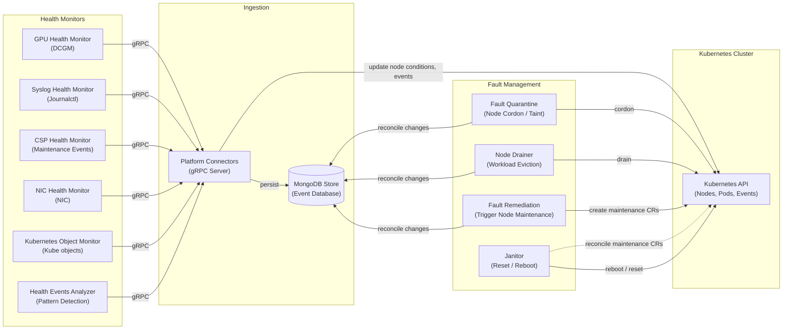

# NVSentinel

[](LICENSE)
[](https://kubernetes.io/)
[](https://helm.sh/)

**NVSentinel detects and remediates GPU faults on Kubernetes nodes**

A single bad GPU can silently corrupt a training run or leave a node sitting idle for hours before anyone notices. NVSentinel **detects** faults as they happen, **protects** jobs by cordoning and draining the affected node, and **remediates** it with a GPU reset or a reboot, returning it to service with no paging required.

- 🔍 **Detect**: real-time GPU, NIC, and system-level fault detection via DCGM, syslog, and cloud provider maintenance events
- 🛡️ **Protect**: cordon and drain the affected node before a fault spreads to other jobs
- 🔧 **Remediate**: auto-repair with a targeted GPU reset or a full reboot, then bring the node back into service
- 🧩 **Extensible**: pluggable health monitors, drain strategies, and remediation actions

> [!NOTE]
> **Beta / Stable**
> NVSentinel is ready for production testing and use. APIs, configurations, and features may change between releases. If you encounter issues, please [open an issue](https://github.com/NVIDIA/NVSentinel/issues) or [start a discussion](https://github.com/NVIDIA/NVSentinel/discussions).

## Prerequisites

- Kubernetes 1.34+ 
- Helm 3.0+
- [NVIDIA GPU Operator](https://github.com/NVIDIA/gpu-operator)
- [cert-manager](https://cert-manager.io/) v1.21+
- Persistent storage support for a database

The commands below get you ready for NVSentinel: the first makes sure the GPU Operator exposes DCGM as its own service, since NVSentinel queries it directly instead of going through dcgm-exporter; the second installs cert-manager, which issues the TLS certificates NVSentinel's webhooks and internal services need.

```bash
# GPU Operator: enable DCGM standalone mode (required)
# By default the GPU Operator embeds DCGM inside dcgm-exporter and doesn't
# expose it as its own service. NVSentinel connects to DCGM directly, so add
# `dcgm.enabled=true` to however you already install/upgrade the GPU Operator:
helm repo add nvidia https://helm.ngc.nvidia.com/nvidia --force-update
helm upgrade --install gpu-operator nvidia/gpu-operator \
  --namespace gpu-operator --create-namespace \
  --set dcgm.enabled=true \
  --wait

# cert-manager (required): issues TLS certs for NVSentinel's webhooks and internal gRPC
helm repo add jetstack https://charts.jetstack.io --force-update
helm upgrade --install cert-manager jetstack/cert-manager \
  --namespace cert-manager --create-namespace \
  --version v1.21.1 --set installCRDs=true \
  --wait
```

## Quick Start

One command works for both a first install and every later upgrade. By default it only turns on health monitoring: it won't cordon a node, evict a pod, or reboot a machine, so it's safe to run anywhere. The flags below the command are everything you can layer on later; see [Adoption](#adoption) for what each one does.

```bash
NVSENTINEL_VERSION=v1.22.0

helm upgrade --install nvsentinel oci://ghcr.io/nvidia/nvsentinel \
  --version "$NVSENTINEL_VERSION" \
  --namespace nvsentinel --create-namespace \
  --set podMonitor.enabled=false \
  --wait

# --set labeler.assumeDriverInstalled=true       # GPU nodes use host-installed drivers
# --set global.mongodbStore.enabled=true         # Protect: cordon
# --set global.faultQuarantine.enabled=true      # Protect: cordon
# --set global.nodeDrainer.enabled=true          # Protect: + drain
# --set global.faultRemediation.enabled=true     # Remediate
# --set global.janitor.enabled=true              # Remediate
# --set global.janitorProvider.enabled=true      # Remediate
# --set janitor-provider.csp.provider=generic    # Remediate
# --set global.preflight.enabled=true            # Preflight
```

Verify it's running:

```bash
kubectl get pods -n nvsentinel
```

## Adoption

We recommend starting with monitoring, then enabling one step at a time as you get comfortable with how NVSentinel runs in your environment.

### 1. Monitor

NVSentinel watches your GPUs and system logs and reports faults as Kubernetes node conditions. Nothing here can disrupt a workload, so it's the safe default to run anywhere while you get a feel for what it reports. The command above already does this; no extra flags needed.

### 2a. Protect: Cordon and drain

Uncomment these flags:

```bash
--set global.mongodbStore.enabled=true \
--set global.faultQuarantine.enabled=true \
--set global.nodeDrainer.enabled=true
```

NVSentinel will now cordon a faulty node, so your scheduler stops placing new work on it, and drain its existing workloads. Only want to cordon, without draining yet? Drop the `nodeDrainer` line above. This is as far as NVSentinel goes unless you also enable remediation below; a cordoned (and optionally drained) node stays isolated until you (or your own tooling) repair it.

### 2b. Protect: Remediate

Remediation builds on Protect, so uncomment all of Protect's flags plus these:

```bash
--set global.faultRemediation.enabled=true \
--set global.janitor.enabled=true \
--set global.janitorProvider.enabled=true \
--set janitor-provider.csp.provider=generic
```

NVSentinel will now reboot a faulty node automatically once it's cordoned and drained. This runs as a privileged job right on the node itself, so it works on day one with no credentials to set up, regardless of whether you're running on-prem or on a CSP. To reboot through your cloud provider's API instead, see the [cloud provider configuration guide](https://docs.nvidia.com/nvsentinel/configuration/janitor-provider/#cloud-provider-selection).

### 3. Preflight (optional)

Preflight tries to keep a job from ever landing on bad hardware. It runs as an active check, an init container in the workload pod, that confirms the node is ready before the job starts.

Uncomment this flag:

```bash
--set global.preflight.enabled=true
```

This uses Kubernetes' native gang scheduling (the `GenericWorkload` and `GangScheduling` feature gates need to be enabled by a cluster admin). Using a different scheduler instead? See the [gang discovery guide](https://docs.nvidia.com/nvsentinel/configuration/preflight/#gang-discovery).

**Label the namespaces that should run it.** It's opt-in per namespace, so nothing changes until you do this:

```bash
kubectl label namespace <your-namespace> nvsentinel.nvidia.com/preflight=enabled
```

Verify it's running: submit a GPU pod in the labeled namespace, then check that preflight added its init containers.

```bash
kubectl get pod <pod-name> -n <your-namespace> -o jsonpath='{.spec.initContainers[*].name}'
```

## Architecture

NVSentinel is a set of independent modules coordinated through a shared MongoDB event store and the Kubernetes API; no module talks to another directly.




## Try the Demo

### Demo Videos

See NVSentinel in action: click any thumbnail to watch.

<table>
<tr>
<td align="center" width="33%">
<a href="https://youtu.be/6HHYMF-YfqY">

<br/><b>End-to-End</b>
</a>
</td>
<td align="center" width="33%">
<a href="https://youtu.be/0qmrHUmxNPQ">

<br/><b>Custom Health Monitors</b>
</a>
</td>
<td align="center" width="33%">
<a href="https://youtu.be/G1j4NV5IMkY">

<br/><b>Custom Drain Plugins</b>
</a>
</td>
</tr>
<tr>
<td align="center" width="33%">
<a href="https://youtu.be/VVAtON7ERHQ">

<br/><b>Extensible Remediation</b>
</a>
</td>
<td align="center" width="33%">
<a href="https://youtu.be/kwWnC0SEFEI">

<br/><b>Health Events Analyzer</b>
</a>
</td>
<td></td>
</tr>
</table>

See the [demos directory](demos/) for full descriptions.

### Run It Locally

Want to try NVSentinel without GPU hardware? Run our **[Local Fault Injection Demo](demos/local-fault-injection-demo/README.md)**:

- 🚀 **5-minute setup** - runs entirely in a local KIND cluster
- 🔍 **Real pipeline** - see fault detection → quarantine → node cordon
- 🎯 **No GPU required** - uses simulated DCGM for testing

```bash
cd demos/local-fault-injection-demo
make demo  # Automated: creates cluster, installs NVSentinel, injects fault, verifies cordon
```

## Supported GPUs

Validated on NVIDIA Volta, Ampere, Hopper, Ada Lovelace and Blackwell architectures. See the [GPU support](https://docs.nvidia.com/nvsentinel/getting-started/overview/#gpu-support) for more information.

## Learn more

For more, including configuration options, external database setup, writing custom health checks, and operational runbooks, visit [docs.nvidia.com/nvsentinel](https://docs.nvidia.com/nvsentinel/).


## Contributing

We welcome contributions! Here's how to get started:

Ways to Contribute:
- 🐛 Report bugs and request features via [issues](https://github.com/NVIDIA/NVSentinel/issues)
- 🧭 See what we're working on in the [roadmap](ROADMAP.md)
- 📝 Improve documentation
- 🧪 Add tests and increase coverage
- 🔧 Submit pull requests to fix issues
- 💬 Help others in [discussions](https://github.com/NVIDIA/NVSentinel/discussions)

Getting Started:
1. Read the [Contributing Guide](CONTRIBUTING.md) for guidelines
2. Check the [Development Guide](DEVELOPMENT.md) for setup instructions
3. Browse [open issues](https://github.com/NVIDIA/NVSentinel/issues) for opportunities

## Support

- 🐛 Bug Reports: [Create an issue](https://github.com/NVIDIA/NVSentinel/issues/new)
- ❓ Questions: [Start a discussion](https://github.com/NVIDIA/NVSentinel/discussions/new?category=q-a)
- 🔒 Security: See [Security Policy](SECURITY.md)

### Stay Connected

- ⭐ **Star** this repository to show your support
- 👀 **Watch** for updates on releases and announcements
- 🔗 **Share** NVSentinel with others who might benefit

## License

Apache License 2.0. See [LICENSE](LICENSE).

---

*Built with ❤️ by NVIDIA for GPU infrastructure reliability*
