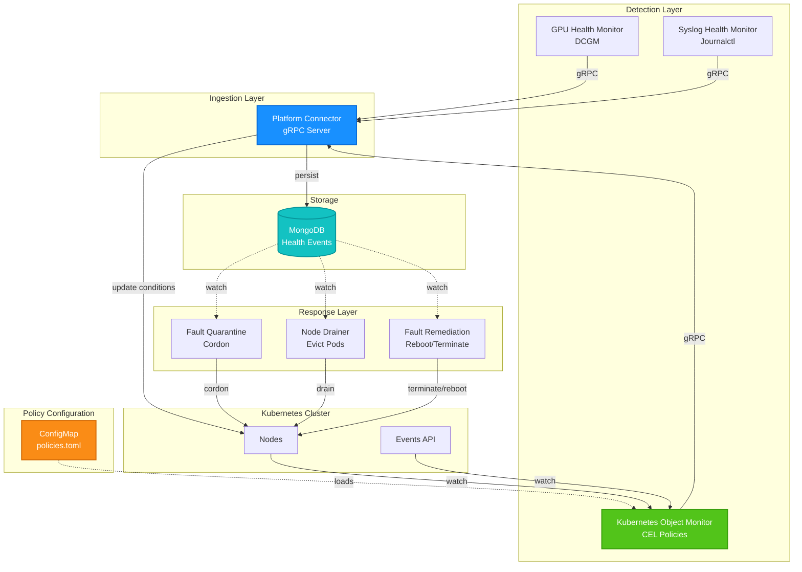

# ADR-011: Kubernetes Object Monitor

## Problem

Although NVSentinel has a pluggable architecture, the barrier to adding new monitors is high. Users must write, test, and deploy a complete health monitor to integrate existing health checks that don't fall into current monitor categories (e.g., storage checks). Many of these existing checks already manifest issues by modifying Kubernetes objects such as node conditions, taints, labels, and annotations.

## Solution 

Develop a policy-driven Kubernetes health monitor that is configurable via CEL policies and publishes health events based on rule matches. This allows users to integrate existing health checks without writing new health monitors.


An example of such configuration would be:
```toml
# ConfigMap: kubernetes-health-monitor-config
# policies.toml

# Node condition-based policy - GPU node not ready for more than 2 hours
[[policies]]
name = "GPUNodeNotReady"
enabled = true

[policies.resource]
group = ""           # Core API group
version = "v1"
kind = "Node"

[policies.predicate]
expression = '''
has(resource.metadata.labels['nvidia.com/gpu.present']) &&
resource.metadata.labels['nvidia.com/gpu.present'] == 'true' &&
resource.status.conditions.exists(c, 
  c.type == 'Ready' && 
  (c.status == 'Unknown' || c.status == 'False') &&
  (now - timestamp(c.lastTransitionTime)) > duration('2h')
)
'''

[policies.healthEvent]
componentClass = "Node"
isFatal = true
message = "GPU node has been NotReady for more than 2 hours"
recommendedAction = "REBOOT_NODE"

# Event-based policy - GPU container runtime failures
# Note: These are Pod events but indicate Node-level GPU issues
# Time-based check ensures recovery when events stop appearing
[[policies]]
name = "NVMLError"
enabled = true

[policies.resource]
group = "events.k8s.io"  # Event API group (v1 Events)
version = "v1"
kind = "Event"

[policies.predicate]
expression = '''
resource.type == 'Warning' &&
resource.reason == 'Failed' &&
resource.regarding.kind == 'Pod' &&
resource.reportingController == 'kubelet' &&
resource.note.contains('nvidia-container-cli') &&
resource.note.contains('nvml error') &&
(now - timestamp(resource.eventTime)) < duration('10m')
'''

# Associate this Event with the Node where the Pod is running
[policies.nodeAssociation]
expression = '''
lookup('v1', 'Pod', resource.regarding.namespace, resource.regarding.name).spec.nodeName
'''

[policies.healthEvent]
componentClass = "GPU"
isFatal = true
message = "GPU container runtime failures detected - likely node GPU driver issue"
recommendedAction = "REBOOT_NODE"
```

### Architecture Overview

The Kubernetes Object Monitor is implemented as a **Deployment** that uses **Kubernetes informers** with a **work-queue** for efficient cluster-wide monitoring. It evaluates CEL-based policies against Kubernetes objects and publishes HealthEvents when policies match.

#### Integration with NVSentinel Breakfix Pipeline



### Key Integration Points

1. Kubernetes Object Monitor watches Kubernetes API resources (based on policy GVKs) via informers
2. Evaluates user-defined CEL policies from ConfigMap (TOML format)
3. Publishes HealthEvents to Platform Connector via gRPC (same interface as other monitors)
4. Platform Connector persists events to MongoDB
5. Downstream modules (Quarantine, Drainer, Remediation) react to events

### Key Components

- **Informer-based watch**: Efficiently monitors Kubernetes resources using client-go informers (dynamically created based on policy GVKs)
- **Work-queue**: Provides retry logic, rate-limiting, and deduplication
- **CEL Policy Engine**: Evaluates user-defined predicates against Kubernetes objects using the `resource` variable


### Watched Resources

Dynamically configured based on policies' GVK specifications:
- **Nodes** (`core/v1/Node`): For condition, taint, label, and annotation checks
- **Events** (`events.k8s.io/v1/Event`): For detecting event-based issues (Pod failures, kubelet errors, etc.)
- Extensible to other resources: Pods, Deployments, StatefulSets, etc.

### Policy Structure

Policies consist of three key components:

1. **Resource (GVK)**: Group/Version/Kind of the Kubernetes resource to watch
   - `group`: API group (empty string `""` for core resources)
   - `version`: API version (e.g., `"v1"`)
   - `kind`: Resource kind (e.g., `"Node"`, `"Event"`)
   
2. **Predicate** (CEL expression): Boolean condition evaluated against the resource object
   - Uses generic `resource` variable that represents the specified GVK object
   - When predicate evaluates to `true` → **unhealthy event sent**
   - When predicate evaluates to `false` → **healthy/recovery event sent**

3. **Node Association** (optional, CEL expression): Associates the health event with a specific Node
   - Required for non-Node resources (Events, Pods, etc.) that should be associated with a Node
   - For Node resources, this is implicit (uses the Node name itself)
   - Expression must return a string (the Node name)
   - Can use `lookup()` function to query related objects

#### Supported Resource Types

- **Nodes**: `group=""`, `version="v1"`, `kind="Node"`
- **Events (v1)**: `group="events.k8s.io"`, `version="v1"`, `kind="Event"`
- Future: Extensible to other Kubernetes resources (Pods, Deployments, etc.)

#### Time-based Conditions

Time-based conditions can be expressed directly in CEL using built-in timestamps:
- Node conditions: `(now - timestamp(resource.status.conditions[0].lastTransitionTime)) > duration('2h')`
- Event timestamps: `(now - timestamp(resource.eventTime)) < duration('5m')` (for recent events only)


#### CEL Variables and Functions

**Variables:**
- `resource` - The Kubernetes resource object being evaluated (type depends on policy's GVK)
  - For Node policies: `resource` is `corev1.Node`
  - For Event policies: `resource` is `eventsv1.Event`
- `now` - Current timestamp (time.Time)

**Custom Functions:**
- `lookup(version, kind, namespace, name)` - Queries the informer cache for a related object
  - **Parameters:**
    - `version`: API version (e.g., `"v1"`, `"apps/v1"`)
    - `kind`: Resource kind (e.g., `"Pod"`, `"Deployment"`)
    - `namespace`: Namespace name (string)
    - `name`: Resource name (string)
  - **Returns:** The Kubernetes object (or null if not found)
  - **Performance:** Uses in-memory informer cache (no API calls)
  - **Example:** `lookup('v1', 'Pod', 'default', 'my-pod').spec.nodeName`

### State Machine

Uniform two-state machine for all resources:

```text
┌─────────────┐
│  Unmatched  │
└──────┬──────┘
       │ Predicate evaluates to true
       ↓
┌─────────────┐
│   Matched   │──→ Send Unhealthy Event
└──────┬──────┘
       │ Predicate evaluates to false
       ↓
┌─────────────┐
│  Unmatched  │──→ Send Healthy Event
└─────────────┘
```

#### Key Characteristics

- Predicate evaluates to `true` → Send unhealthy health event
- Predicate evaluates to `false` → Send healthy/recovery health event
- Time conditions expressed directly in CEL (e.g., `now - lastTransitionTime > 2h`)
- No state persistence needed - all logic in CEL predicates


### Reconciliation Triggers

The controller reconciles on two triggers:

#### 1. Resource Changes (Event-Driven)

- Informers watch configured GVK resources (e.g., Nodes, Events)
- When a watched resource changes (create/update/delete), triggers reconciliation
- For each policy matching the resource's GVK, evaluate the CEL predicate

#### 2. Periodic Reconciliation

- Required for time-based predicates (e.g., "NotReady for more than 2 hours")
- When a Node condition transitions to NotReady, the predicate evaluates to `false` initially
- After 2 hours, periodic reconciliation re-evaluates and detects the threshold crossing
- Configured via `--resync-period` flag (e.g., `5m`)

#### Evaluation Result

- Predicate evaluates to `true` → Send unhealthy event
- Predicate evaluates to `false` → Send healthy event

### Reconciliation Logic

Uniform reconciliation for all resources:

1. Retrieve the resource object (from informer cache)
2. For each policy matching the resource's GVK, evaluate the CEL predicate
3. If predicate evaluates to `true`:
   - Publish unhealthy HealthEvent via gRPC
4. If predicate evaluates to `false`:
   - Publish healthy/recovery HealthEvent via gRPC
5. Multiple **resource instances** can be reconciled concurrently (configured via `MaxConcurrentReconciles`)
   - Example: With `MaxConcurrentReconciles: 10`, up to 10 different resources can be processed simultaneously
   - Resources can be of any type: Nodes, Events, Pods, or any other configured GVK
   - Each reconciliation evaluates all applicable policies for that specific resource instance
   - This is per-resource parallelism, not per-policy parallelism

### Node Association Patterns

The `nodeAssociation` field allows flexible mapping of resources to Nodes using CEL expressions.

#### Pattern 1: Direct Node Name (from current resource)

For resources that directly contain a node reference:

```toml
# Pod policy - node name is directly in the Pod spec
[policies.nodeAssociation]
expression = "resource.spec.nodeName"
```

#### Pattern 2: Lookup Related Object

For Events or other resources that reference another object:

```toml
# Pod Event → lookup Pod → get node name
[policies.nodeAssociation]
expression = '''
lookup('v1', 'Pod', resource.regarding.namespace, resource.regarding.name).spec.nodeName
'''
```

**Note:** For Node resources, `nodeAssociation` is not required - the Node name is automatically used.

#### Implementation: Custom CEL Function

The `lookup()` function is implemented as a custom CEL function in the Kubernetes Object Monitor:

```go
// Pseudo-code for implementation
func CreateCELEnvironment(informerCache cache.Cache) (*cel.Env, error) {
    return cel.NewEnv(
        cel.Variable("resource", cel.DynType),
        cel.Variable("now", cel.TimestampType),
        cel.Function("lookup",
            cel.Overload("lookup_string_string_string_string",
                []*cel.Type{cel.StringType, cel.StringType, cel.StringType, cel.StringType},
                cel.DynType,
                cel.FunctionBinding(func(args ...ref.Val) ref.Val {
                    version := args[0].Value().(string)
                    kind := args[1].Value().(string)
                    namespace := args[2].Value().(string)
                    name := args[3].Value().(string)
                    
                    // Query informer cache (no API call)
                    obj, err := informerCache.Get(version, kind, namespace, name)
                    if err != nil || obj == nil {
                        return types.NullValue
                    }
                    return types.NewDynamicMap(types.DefaultTypeAdapter, obj)
                }),
            ),
        ),
    )
}
```

**Key characteristics:**
- Queries in-memory informer cache (fast, no API overhead)
- Type-safe at CEL compilation time
- Standard practice in Kubernetes CEL usage


### Recovery Event Handling

Recovery is handled uniformly for all resource types:

- When CEL predicate evaluates to `false`, a healthy/recovery HealthEvent is published
- Works for all resources: Nodes, Events, Pods, Deployments, etc.

#### Examples

- Node condition `Ready=False` → `Ready=True` (predicate becomes false → healthy event)
- Event disappears or becomes stale (predicate with time check becomes false → healthy event)
- Pod status changes from `Failed` → `Running` (predicate becomes false → healthy event)

#### Event Recovery Pattern

For Events to support recovery, the CEL predicate should include time-based checks:
```cel
resource.type == 'Warning' && 
resource.reason == 'Failed' &&
(now - timestamp(resource.eventTime)) < duration('5m')  // Only match recent events
```
When the event becomes older than 5 minutes, the predicate returns false → healthy event sent automatically.


### Operational Configuration (Container Args & Environment Variables)

Controller-level settings are configured via command-line flags and environment variables:

**Command-line Flags:**

| Flag | Type | Default | Description |
|------|------|---------|-------------|
| `--resync-period` | duration | `5m` | Periodic reconciliation interval for all watched resources |
| `--max-concurrent-reconciles` | int | `10` | Maximum number of resources to reconcile concurrently |
| `--policy-config-path` | string | `/etc/nvsentinel/config/policies.toml` | Path to policy configuration file |
| `--metrics-bind-address` | string | `:8080` | Address to bind Prometheus metrics endpoint |
| `--health-probe-bind-address` | string | `:8081` | Address to bind health probe endpoints |

**Environment Variables:**

| Variable | Type | Default | Description |
|----------|------|---------|-------------|
| `LOG_LEVEL` | string | `info` | Log level (debug, info, warn, error) |

## Metrics

The Kubernetes Object Monitor exposes Prometheus metrics for observability and debugging.

| Metric Name | Type | Labels | Description |
|------------|------|--------|-------------|
| `k8s_object_monitor_policy_matches_total` | Counter | `policy_name`, `node`, `resource_kind` | Total number of times a policy matched (predicate=true), indicating detected issues by node |
| `k8s_object_monitor_policy_evaluation_errors_total` | Counter | `policy_name`, `error_type` | Policy evaluation errors. `error_type`: `cel_error`, `lookup_error`, `node_association_error` |
| `k8s_object_monitor_health_events_publish_errors_total` | Counter | `policy_name`, `error_type` | Errors publishing health events to Platform Connector via gRPC |
| `k8s_object_monitor_reconciliation_errors_total` | Counter | `resource_kind`, `error_type` | Controller reconciliation errors |
