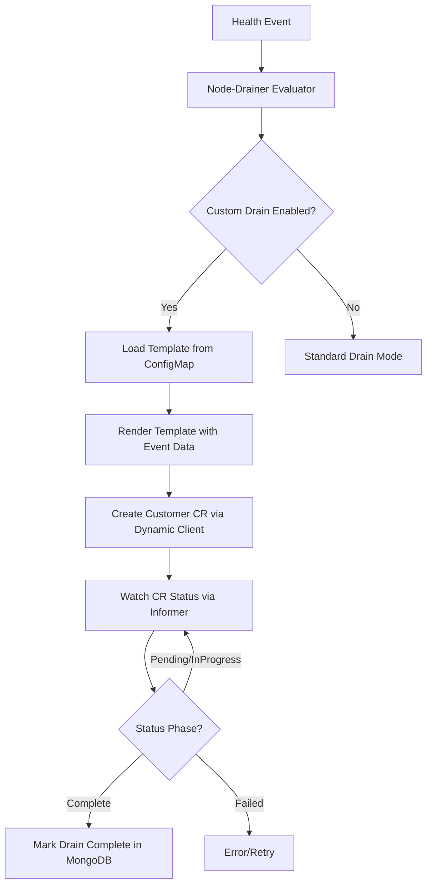

# ADR-015: Behavior — Node Drain Extensibility

## Context

Current flow of node drainer essentially runs `kubectl drain` and when exactly a node will be drained in a cluster is configurable by configmap using `mode` which are: `Immediate`, `DeleteAfterTimeout` and `AllowCompletion`. These three modes essentially covers the entire lifecycle of workload. This works in most of the cases but there are some cases where additional coordination with scheduler (or meta scheduler) present in the cluster is required. Hence, we need a way to extend the functionality of node drain to make it aware of the ecosystem around scheduler present in the cluster.

## Decision

Design a node drain API using Custom Resource Definitions (CRDs) to represent custom drain operations. This API will be consumed by scheduler-specific bridge controllers to perform custom drain logic.

## Implementation

### Architecture



### Template Variables

```go
type TemplateData struct {
  // Health event from platform connector
  HealthEvent   HealthEvent

   // Map of namespace → pod names to drain (excludes system namespaces)
   // Assumption: Node is already quarantined; pods are snapshot at event arrival time
  PodsToDrain   map[string][]string
}
```

### Configuration (TOML)

```toml
systemNamespaces = "^(kube-system|gpu-operator)"
[customDrain]
    enabled = false

    templateMountPath = "/etc/drain-templates" # Where node-drainer mounts its ConfigMap
    templateFileName = "drain-template.yaml" # Name of the template file
    namespace = "nvsentinel"
    apiGroup = "nvsentinel.nvidia.com"
    version = "v1alpha1"
    kind = "DrainRequest"


    timeout = "3600s"

    # Status watching (follows Kubernetes standard: DrainInProgress, DrainComplete, DrainFailed)
    statusConditionType = "DrainComplete"
    statusConditionStatus = "True"
```

### Template Example

Name of the CR will follow the pattern `drain-<node-name>-<health-event-id>` and namespace will be `nvsentinel`.
```yaml
apiVersion: nvsentinel.nvidia.com/v1alpha1
kind: DrainRequest
spec:
    nodeName: {{ .HealthEvent.NodeName }} # Kubernetes node name
    checkName: {{ .HealthEvent.CheckName }}
    recommendedAction: {{ .HealthEvent.RecommendedAction }}
    errorCode: {{ .HealthEvent.ErrorCode }}

    entitiesImpacted:
    {{- range .HealthEvent.EntitiesImpacted }}
    - type: {{ .EntityType }}
      value: {{ .EntityValue }}
    {{- end }}

    metadata:
    {{- range $key, $value := .HealthEvent.Metadata }}
        {{ $key }}: {{ $value }}
    {{- end }}

    reason: "{{ .HealthEvent.Message }}"

    podsToDrain:
    {{- range $namespace, $pods := .PodsToDrain }}
        {{ $namespace }}:
        {{- range $pods }}
            - {{ . }}
        {{- end }}
    {{- end }}
status:
  conditions:
    - type: DrainComplete
      status: "False"
      reason: Pending
```

### Node-Drainer Changes

1. Evaluator (`evaluator/evaluator.go`):
```go
if e.config.CustomDrain.Enabled {
    crName := getCRName(nodeName, eventID)
    
    if !CRExists(crName) {
        return &DrainActionResult{
            Action:     ActionCreateCR,
            Namespaces: namespaces,
        }, nil
    }
    
    if !CRComplete(crName) {
        if isCRTimedOut(crName) {
            return &DrainActionResult{Action: ActionDrainFailed}, nil
        }
        return &DrainActionResult{Action: ActionWait}, nil
    }
    
    // CR complete = customer already evicted pods, mark as drained
    return &DrainActionResult{
        Action: ActionMarkAlreadyDrained,
    }, nil
}
```

2. Custom Drain Client (`customdrain/client.go`):
```go
// Same pattern as fault-remediation
func (c *Client) CreateDrainCR(ctx context.Context, data TemplateData) (error) {
    // 1. Execute template
    // 2. Parse YAML to unstructured
    // 3. Create CR via dynamic client
    // 4. Return error if any
}

func (c *Client) GetCRStatus(ctx context.Context, crName string) (bool, error) {
    // 1. Get CR via dynamic client
    // 2. Extract status.conditions array
    // 3. Check if condition type matches config and status is True
    // 4. Return true if complete, false otherwise
}

func (c *Client) DeleteDrainCR(ctx context.Context, crName string) error {
    // 1. Delete CR via dynamic client
    // 2. Return error if any
}
```

3. Reconciler (`reconciler/reconciler.go`):
```go
func (r *Reconciler) executeAction(..., eventID string) error {
    nodeName := healthEvent.HealthEvent.NodeName
    
    switch action.Action {
    case ActionCreateCR:
        templateData := buildTemplateData(healthEvent, action.Namespaces, nodeName)
        return r.customDrainClient.CreateDrainCR(ctx, templateData)
    
    case ActionMarkAlreadyDrained:
        err := r.executeMarkAlreadyDrained(ctx, healthEvent, event, database)
        
        if err == nil && customDrain.Enabled {
            crName := getCRName(nodeName, eventID)

            // Delete CR to prevent accumulation
            r.customDrainClient.DeleteDrainCR(ctx, crName)
        }
        return err
    
    case ActionDrainFailed:
        crName := getCRName(nodeName, eventID)
        r.customDrainClient.DeleteDrainCR(ctx, crName)
        return r.updateDrainStatustoFailed(ctx, nodeName, eventID)
    
    // ... existing cases (ActionSkip, ActionWait, ActionEvictImmediate, etc.)
    }
```

Design Constraint: Node drainer must be either configured to use the built-in drain modes (Immediate, DeleteAfterTimeout, AllowCompletion) or the custom drain mode, not both. This is enforced by configuration validation.

### Customer Controller Example

```go
func (c *SlurmController) Reconcile(ctx context.Context, req ctrl.Request) (ctrl.Result, error) {
    drainReq := &SlurmDrainRequest{}
    if err := c.Get(ctx, req.NamespacedName, drainReq); err != nil {
        return ctrl.Result{}, client.IgnoreNotFound(err)
    }
    
    // Already complete, nothing to do
    if meta.IsStatusConditionTrue(drainReq.Status.Conditions, "DrainComplete") {
        return ctrl.Result{}, nil
    }
    
    // Start Slurm drain if not started
    if !meta.IsStatusConditionTrue(drainReq.Status.Conditions, "DrainInProgress") {
        // Template will contain the kubernetes node name 
        // We need to convert it to slurm node name
        slurmNodeName := getSlurmNodeName(drainReq.Spec.NodeName)
        c.slurmClient.UpdateNode(slurmNodeName, slurm.NodeUpdate{State: "DRAIN"})
        meta.SetStatusCondition(&drainReq.Status.Conditions, metav1.Condition{
            Type: "DrainInProgress", Status: metav1.ConditionTrue, Reason: "DrainStarted",
        })
        c.Status().Update(ctx, drainReq)
        return ctrl.Result{RequeueAfter: 30 * time.Second}, nil
    }
    
    // Check if all Slurm jobs completed
    jobs := c.slurmClient.GetJobs(slurm.JobFilter{Node: drainReq.Spec.NodeName})
    if len(jobs) == 0 {
        meta.SetStatusCondition(&drainReq.Status.Conditions, metav1.Condition{
            Type: "DrainComplete", Status: metav1.ConditionTrue, Reason: "AllJobsCompleted",
        })
        c.Status().Update(ctx, drainReq)
        return ctrl.Result{}, nil  // Done, no requeue
    }
    
    // Still draining, check again later
    return ctrl.Result{RequeueAfter: 30 * time.Second}, nil
}
```

## Rationale

Why template-based CRD approach:

1. Maximum flexibility: Customers use their own CRDs, not constrained by NVSentinel schema
2. Kubernetes-native: Built-in observability (`kubectl`, events, metrics), persistent state (etcd)

## Consequences

### Positive
- Customers own CRD schema, works with existing CRDs (e.g., Slurm Operator)
- Zero code changes for new integrations (template + controller only)
- Reuses fault-remediation pattern (code, familiar approach)
- Kubernetes-native (persistent state, audit trail, standard tooling)

### Negative
- Requires CRD/controller knowledge and Go template syntax
- Debugging complexity across template/CR/controller layers

### Mitigations
- Reference implementations and comprehensive documentation
- Example controllers for common integrations (Slurm, checkpoint, etc.)

## Alternatives Considered

### 1. Fixed NVSentinel DrainRequest CRD
Define one `DrainRequest` CRD that all customers use.

**Rejected**: Schema lock-in, versioning complexity, can't reuse existing CRDs, NVSentinel dependency.

### 2. Sidecar with Protobuf API
Deploy sidecar container with drain logic API.

**Rejected**: Can't support customer-side controllers (localhost only), tight coupling, no persistence, limited observability.


### 3. Webhook/HTTP API
Node-drainer POSTs drain requests to customer HTTP service, polls status endpoint for completion.

**Rejected**: Requires customers to run HTTP servers with auth/TLS, no state persistence in Kubernetes, not observable via kubectl, doesn't fit async workflows (long-running drains).

## Notes

- **"User coordination"** = customer-side automation (not human operators)
- **Opt-in**: Feature disabled by default, no breaking changes
- **Non-goals**: Auto template discovery, multi-cluster and human approval workflows


## Testing

- **Unit**: Template parsing, dynamic client CR creation, status polling, GVK→GVR mapping
- **Integration**: Mock controller updates CR, verify node-drainer detects completion
- **E2E**: Deploy test CRD + controller, trigger health event, verify end-to-end flow

## References

- [GitHub Issue #351](https://github.com/NVIDIA/NVSentinel/issues/351) - Original feature request
- [Slurm Operator](https://github.com/SlinkyProject/slurm-operator) - Example integration
- [ADR-009: Fault Remediation](./009-fault-remediation-triggering.md) - Same pattern
