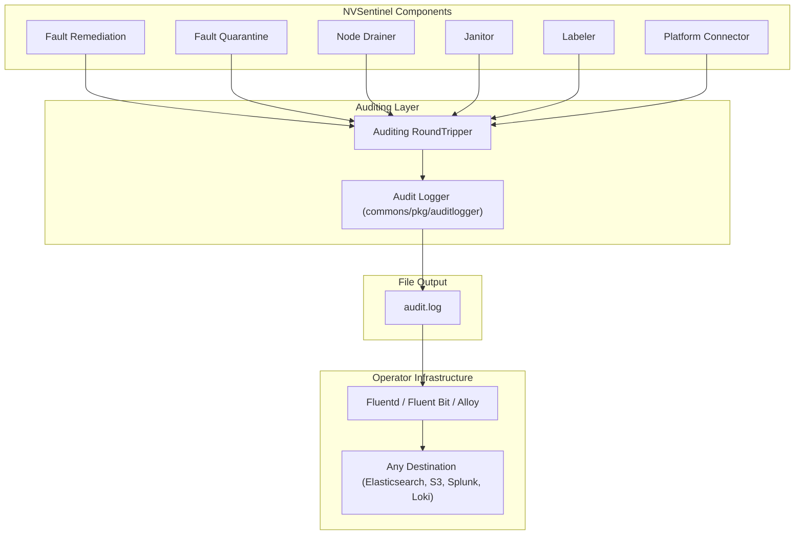

# ADR-016: Audit Logging for NVSentinel Write Operations

## Problem

NVSentinel performs critical write operations on Kubernetes and cloud infrastructure. Operators need an immutable record of every operation for:

- **Accountability**: Prove what NVSentinel did or did not do on a cluster
- **Compliance**: Audit trails for infrastructure changes
- **Debugging**: Trace exact API calls when investigating issues

### Audit Logs vs Metrics

Metrics show aggregated behavior (`nodes_cordoned_total: 42`). Audit logs capture every individual API call with timestamp, URL, method, and optionally request body - details that would cause cardinality explosion in metrics.

## Solution

Implement a file-based audit logging system that:

1. **Automatically captures write operations** via HTTP RoundTripper wrapping client-go and CSP SDKs
2. **Writes structured JSON logs to a file** (`/var/log/nvsentinel/{POD_NAME}-audit.log`)
3. **Leverages existing log collection infrastructure** (Fluentd/Fluent Bit/Alloy) for shipping logs to any destination
4. **Uses existing logging patterns** - new `commons/pkg/auditlogger/` package with direct JSON encoding

This approach follows the same pattern used by Kubernetes itself (`/var/log/kubernetes/audit.log`) and other operators.

### Architecture Overview



### Key Design Principles

1. **Automatic Capture**: HTTP RoundTripper intercepts all write operations
2. **File-Based Output**: Structured JSON to file, operators ship via their log collection infrastructure
3. **Minimal Dependencies**: No external services required for audit logging itself

## Audited Components and Operations

We audit calls made to **external systems** only (Kubernetes API and CSPs), not internal datastore calls.

| Component | Operation | Description | HTTP Method |
|-----------|-----------|-------------|-------------|
| **fault-quarantine** | Cordon/Taint nodes | Quarantine unhealthy nodes | PUT |
| **node-drainer** | Evict pods, Force delete | Evict/delete pods from unhealthy nodes | POST, DELETE |
| **fault-remediation** | Create maintenance CR, Update annotations | Create RebootNode/TerminateNode CR | POST, PATCH |
| **janitor** | Update CR, CSP calls | Execute reboot/terminate via cloud provider API | PUT, POST |
| **labeler** | Update node labels | Update node labels (DCGM version, driver, kata) | PUT |
| **platform-connector** | Create/Update node events and conditions | K8s Events and Node Conditions | POST, PATCH |

### Not Audited (Read-Only Components)

- Health Monitors (GPU, Syslog, Kubernetes Object Monitor) - only detect and report
- MongoDB Change Streams - read operations only

## Data Model

### AuditEntry Structure

```go
type AuditEntry struct {
    Timestamp   string `json:"timestamp"`
    Component   string `json:"component"`
    Method      string `json:"method"`
    URL         string `json:"url"`
    RequestBody string `json:"requestBody,omitempty"`
}
```

The `RequestBody` field is optional and only included when `AUDIT_LOG_REQUEST_BODY=true`. With method, URL, and request body, the specific operation can be inferred.

### Audit Log Example

**Default:**
```json
{"timestamp":"2025-01-15T10:30:45Z","component":"fault-quarantine","method":"PUT","url":"/api/v1/nodes/gpu-node-01"}
```

**With body enabled (`AUDIT_LOG_REQUEST_BODY=true`):**

**fault-quarantine operations:**
```json
// Cordon node
{"timestamp":"2025-01-15T10:30:45Z","component":"fault-quarantine","method":"PUT","url":"/api/v1/nodes/gpu-node-01","requestBody":"{\"spec\":{\"unschedulable\":true}}"}

// Uncordon node
{"timestamp":"2025-01-15T10:30:46Z","component":"fault-quarantine","method":"PUT","url":"/api/v1/nodes/gpu-node-01","requestBody":"{\"spec\":{\"unschedulable\":false}}"}

// Add taint
{"timestamp":"2025-01-15T10:30:47Z","component":"fault-quarantine","method":"PUT","url":"/api/v1/nodes/gpu-node-01","requestBody":"{\"spec\":{\"taints\":[{\"key\":\"nvsentinel.nvidia.com/unhealthy\",\"effect\":\"NoSchedule\"}]}}"}

// Update circuit breaker ConfigMap
{"timestamp":"2025-01-15T10:30:48Z","component":"fault-quarantine","method":"PUT","url":"/api/v1/namespaces/nvsentinel/configmaps/circuit-breaker","requestBody":"{\"data\":{\"status\":\"open\"}}"}
```

**node-drainer operations:**
```json
// Evict pod
{"timestamp":"2025-01-15T10:31:00Z","component":"node-drainer","method":"POST","url":"/api/v1/namespaces/default/pods/my-pod/eviction","requestBody":"{\"apiVersion\":\"policy/v1\",\"kind\":\"Eviction\",\"metadata\":{\"name\":\"my-pod\"}}"}

// Force delete pod (after timeout)
{"timestamp":"2025-01-15T10:31:01Z","component":"node-drainer","method":"DELETE","url":"/api/v1/namespaces/default/pods/my-pod?gracePeriodSeconds=0"}

// Update node label (drain status)
{"timestamp":"2025-01-15T10:31:02Z","component":"node-drainer","method":"PATCH","url":"/api/v1/nodes/gpu-node-01","requestBody":"{\"metadata\":{\"labels\":{\"nvsentinel.nvidia.com/state\":\"draining\"}}}"}
```

**fault-remediation operations:**
```json
// Create RebootNode CR
{"timestamp":"2025-01-15T10:32:00Z","component":"fault-remediation","method":"POST","url":"/apis/janitor.dgx.nvidia.com/v1alpha1/rebootnodes","requestBody":"{\"metadata\":{\"name\":\"maintenance-gpu-node-01-abc123\"},\"spec\":{\"nodeName\":\"gpu-node-01\"}}"}

// Create TerminateNode CR
{"timestamp":"2025-01-15T10:32:01Z","component":"fault-remediation","method":"POST","url":"/apis/janitor.dgx.nvidia.com/v1alpha1/terminatenodes","requestBody":"{\"metadata\":{\"name\":\"maintenance-gpu-node-01-def456\"},\"spec\":{\"nodeName\":\"gpu-node-01\"}}"}

// Update node annotation (remediation state)
{"timestamp":"2025-01-15T10:32:02Z","component":"fault-remediation","method":"PATCH","url":"/api/v1/nodes/gpu-node-01","requestBody":"{\"metadata\":{\"annotations\":{\"nvsentinel.nvidia.com/remediation-state\":\"{...}\"}}}"}
```

**janitor operations:**
```json
// Update CR with finalizer
{"timestamp":"2025-01-15T10:33:00Z","component":"janitor","method":"PUT","url":"/apis/janitor.dgx.nvidia.com/v1alpha1/rebootnodes/maintenance-gpu-node-01-abc123"}

// Update CR status
{"timestamp":"2025-01-15T10:33:01Z","component":"janitor","method":"PUT","url":"/apis/janitor.dgx.nvidia.com/v1alpha1/rebootnodes/maintenance-gpu-node-01-abc123/status"}

// CSP: AWS Reboot
{"timestamp":"2025-01-15T10:33:02Z","component":"janitor","method":"POST","url":"https://ec2.amazonaws.com/?Action=RebootInstances&InstanceId=i-1234567890abcdef0"}

// CSP: GCP Stop+Start (reboot)
{"timestamp":"2025-01-15T10:33:03Z","component":"janitor","method":"POST","url":"https://compute.googleapis.com/compute/v1/projects/my-project/zones/us-central1-a/instances/gpu-node-01/stop"}

// CSP: Azure Restart
{"timestamp":"2025-01-15T10:33:04Z","component":"janitor","method":"POST","url":"https://management.azure.com/subscriptions/.../virtualMachines/gpu-node-01/restart"}

// CSP: OCI Instance Action
{"timestamp":"2025-01-15T10:33:05Z","component":"janitor","method":"POST","url":"https://iaas.us-phoenix-1.oraclecloud.com/.../instances/ocid1.../action?action=RESET"}
```

**labeler operations:**
```json
// Update DCGM version label
{"timestamp":"2025-01-15T10:34:00Z","component":"labeler","method":"PUT","url":"/api/v1/nodes/gpu-node-01","requestBody":"{\"metadata\":{\"labels\":{\"nvidia.com/dcgm.version\":\"4.x\"}}}"}

// Update driver installed label
{"timestamp":"2025-01-15T10:34:01Z","component":"labeler","method":"PUT","url":"/api/v1/nodes/gpu-node-01","requestBody":"{\"metadata\":{\"labels\":{\"nvidia.com/gpu.driver.installed\":\"true\"}}}"}

// Update kata enabled label
{"timestamp":"2025-01-15T10:34:02Z","component":"labeler","method":"PUT","url":"/api/v1/nodes/gpu-node-01","requestBody":"{\"metadata\":{\"labels\":{\"nvidia.com/kata.enabled\":\"true\"}}}"}
```

**platform-connector operations:**
```json
// Create node event
{"timestamp":"2025-01-15T10:35:00Z","component":"platform-connector","method":"POST","url":"/api/v1/namespaces/default/events","requestBody":"{\"involvedObject\":{\"kind\":\"Node\",\"name\":\"gpu-node-01\"},\"reason\":\"GPUError\",\"message\":\"...\"}"}

// Update node conditions
{"timestamp":"2025-01-15T10:35:01Z","component":"platform-connector","method":"PATCH","url":"/api/v1/nodes/gpu-node-01/status"}
```

With method + URL + body, the specific operation can be inferred.

## Implementation

### Package Structure

```text
commons/
└── pkg/
    ├── logger/           # Existing - writes to stderr
    │   └── logger.go
    │
    └── auditlogger/      # NEW - writes to file
        ├── auditlogger.go    # Main audit logger (direct JSON encoding)
        └── roundtripper.go   # HTTP RoundTripper for automatic capture
```

### Audit Logger Package

```go
package auditlogger

import (
    "encoding/json"
    "fmt"
    "os"
    "path/filepath"
    "strconv"
    "time"

    "gopkg.in/natefinch/lumberjack.v2"
)

const (
    DefaultAuditLogDir     = "/var/log/nvsentinel"
    EnvAuditLogBasePath    = "AUDIT_LOG_BASE_PATH"
    EnvAuditEnabled        = "AUDIT_ENABLED"
    EnvAuditLogRequestBody = "AUDIT_LOG_REQUEST_BODY"
    EnvPodName             = "POD_NAME"
    EnvAuditLogMaxSize     = "AUDIT_LOG_MAX_SIZE_MB"
    EnvAuditLogMaxBackups  = "AUDIT_LOG_MAX_BACKUPS"
    EnvAuditLogMaxAge      = "AUDIT_LOG_MAX_AGE_DAYS"
    EnvAuditLogCompress    = "AUDIT_LOG_COMPRESS"
)

type AuditEntry struct {
    Timestamp   string `json:"timestamp"`
    Component   string `json:"component"`
    Method      string `json:"method"`
    URL         string `json:"url"`
    RequestBody string `json:"requestBody,omitempty"`
}

var (
    auditLogger *lumberjack.Logger
    component   string
)

func getEnvInt(key string, defaultVal int) int {
    if v := os.Getenv(key); v != "" {
        if i, err := strconv.Atoi(v); err == nil {
            return i
        }
    }
    return defaultVal
}

func getEnvBool(key string, defaultVal bool) bool {
    if v := os.Getenv(key); v != "" {
        if b, err := strconv.ParseBool(v); err == nil {
            return b
        }
    }
    return defaultVal
}

func InitAuditLogger(comp string) error {
    if comp == "" {
        return fmt.Errorf("component name cannot be empty")
    }
    
    if os.Getenv(EnvAuditEnabled) == "false" {
        return nil
    }
    
    component = comp
    
    baseDir := os.Getenv(EnvAuditLogBasePath)
    if baseDir == "" {
        baseDir = DefaultAuditLogDir
    }
    
    podName := os.Getenv(EnvPodName)
    if podName == "" {
        podName = component
    }
    if podName == "" {
        return fmt.Errorf("unable to determine pod name: POD_NAME env var and component are both empty")
    }
    
    logPath := filepath.Join(baseDir, podName+"-audit.log")
    
    if err := os.MkdirAll(baseDir, 0700); err != nil {
        return err
    }
    
    auditLogger = &lumberjack.Logger{
        Filename:   logPath,
        MaxSize:    getEnvInt(EnvAuditLogMaxSize, 100),
        MaxBackups: getEnvInt(EnvAuditLogMaxBackups, 7),
        MaxAge:     getEnvInt(EnvAuditLogMaxAge, 30),
        Compress:   getEnvBool(EnvAuditLogCompress, true),
    }
    
    return nil
}

func CloseAuditLogger() error {
    if auditLogger != nil {
        return auditLogger.Close()
    }
    return nil
}

func Log(method, url, body string) {
    if auditLogger == nil {
        return
    }
    
    entry := AuditEntry{
        Timestamp: time.Now().UTC().Format(time.RFC3339),
        Component: component,
        Method:    method,
        URL:       url,
    }
    
    if os.Getenv(EnvAuditLogRequestBody) == "true" && body != "" {
        entry.RequestBody = body
    }
    
    if err := json.NewEncoder(auditLogger).Encode(entry); err != nil {
        fmt.Fprintf(os.Stderr, "audit: failed to write entry: %v\n", err)
    }
}
```

### Log Rotation

The `InitAuditLogger` function uses [lumberjack](https://github.com/natefinch/lumberjack) for built-in log rotation with the following settings:

**Output format:**
```json
{"timestamp":"2025-11-27T19:29:26Z","component":"fault-quarantine","method":"PUT","url":"/api/v1/nodes/gpu-node-01"}
```

| Option | Default | Description |
|--------|---------|-------------|
| `MaxSize` | 100 MB | Max size before rotation |
| `MaxBackups` | 7 | Number of old log files to keep |
| `MaxAge` | 30 days | Max age of old log files |
| `Compress` | true | Compress rotated files with gzip |

### HTTP RoundTripper for Automatic Capture

```go
package auditlogger

import (
    "bytes"
    "io"
    "net/http"
    "os"
)

type AuditingRoundTripper struct {
    delegate http.RoundTripper
}

func NewAuditingRoundTripper(delegate http.RoundTripper) *AuditingRoundTripper {
    return &AuditingRoundTripper{delegate: delegate}
}

func (rt *AuditingRoundTripper) RoundTrip(req *http.Request) (*http.Response, error) {
    if isWriteMethod(req.Method) {
        body := ""
        if os.Getenv(EnvAuditLogRequestBody) == "true" && req.Body != nil {
            bodyBytes, _ := io.ReadAll(req.Body)
            req.Body = io.NopCloser(bytes.NewBuffer(bodyBytes))
            body = string(bodyBytes)
        }
        Log(req.Method, req.URL.String(), body)
    }
    return rt.delegate.RoundTrip(req)
}

func isWriteMethod(method string) bool {
    return method == "POST" || method == "PUT" || method == "PATCH" || method == "DELETE"
}
```

**Limitation**: HTTP RoundTripper only works for REST/HTTP-based clients. For gRPC clients, use gRPC interceptors.

### gRPC Interceptor

> **Note**: This section is included as a reference for future implementation. Currently, all NVSentinel CSP clients use REST (e.g., `NewInstancesRESTClient()` for GCP), so the HTTP RoundTripper covers all use cases. When CSP modules move to gRPC clients (e.g., GCP protobuf clients), this interceptor pattern will be used.
>
> This is **not** for internal NVSentinel communication (e.g., health monitors → platform connector). We only audit external API calls to Kubernetes and CSPs.

For gRPC clients, use interceptors to audit write operations:

```go
import (
    "context"
    "encoding/json"
    "os"
    "strings"

    "google.golang.org/grpc"
    "github.com/NVIDIA/NVSentinel/commons/pkg/auditlogger"
)

func AuditingUnaryInterceptor() grpc.UnaryClientInterceptor {
    return func(ctx context.Context, method string, req, reply interface{},
        cc *grpc.ClientConn, invoker grpc.UnaryInvoker, opts ...grpc.CallOption) error {
        
        if isWriteRPC(method) {
            body := ""
            if os.Getenv(auditlogger.EnvAuditLogRequestBody) == "true" {
                if b, err := json.Marshal(req); err == nil {
                    body = string(b)
                }
            }
            auditlogger.Log("gRPC", method, body)
        }
        
        return invoker(ctx, method, req, reply, cc, opts...)
    }
}

func isWriteRPC(method string) bool {
    parts := strings.Split(method, "/")
    rpcName := parts[len(parts)-1]
    
    writePrefixes := []string{"Create", "Update", "Delete", "Patch", "Put", "Replace", "Insert", "Remove"}
    for _, prefix := range writePrefixes {
        if strings.HasPrefix(rpcName, prefix) {
            return true
        }
    }
    return false
}

// Usage:
conn, _ := grpc.Dial(target, grpc.WithUnaryInterceptor(AuditingUnaryInterceptor()))
```

### Integration Pattern

#### Kubernetes Client Integration

```go
func main() {
    if err := auditlogger.InitAuditLogger("fault-quarantine"); err != nil {
        slog.Warn("Failed to initialize audit logger", "error", err)
    }
    defer auditlogger.CloseAuditLogger()
    
    restConfig, _ := rest.InClusterConfig()
    restConfig.Wrap(func(rt http.RoundTripper) http.RoundTripper {
        return auditlogger.NewAuditingRoundTripper(rt)
    })
    
    clientset, _ := kubernetes.NewForConfig(restConfig)
    // ...
}

func (c *Client) QuarantineNode(nodeName string) error {
    _, err := c.clientset.CoreV1().Nodes().Update(...)
    return err
    // Logged: {"timestamp":"...","component":"fault-quarantine","method":"PUT","url":"/api/v1/nodes/gpu-node-01"}
}
```

#### CSP SDK Integration

For CSP SDKs, wrap the existing transport to preserve SDK-configured settings.

**Helper function:**

```go
func wrapTransport(client *http.Client) {
    existing := client.Transport
    if existing == nil {
        existing = http.DefaultTransport
    }
    client.Transport = auditlogger.NewAuditingRoundTripper(existing)
}
```

**AWS SDK:**

```go
func NewAWSEC2Client(ctx context.Context) (*ec2.Client, error) {
    cfg, err := config.LoadDefaultConfig(ctx)
    if err != nil {
        return nil, err
    }

    httpClient := cfg.HTTPClient
    if httpClient == nil {
        httpClient = &http.Client{}
    }
    wrapTransport(httpClient)
    cfg.HTTPClient = httpClient

    return ec2.NewFromConfig(cfg), nil
}
```

**GCP SDK:**

```go
func NewGCPComputeClient(ctx context.Context) (*compute.InstancesRESTClient, error) {
    httpClient := &http.Client{}
    wrapTransport(httpClient)

    return compute.NewInstancesRESTClient(ctx, option.WithHTTPClient(httpClient))
}
```

**Azure SDK:**

```go
func NewAzureVMClient(ctx context.Context, subscriptionID string) (*armcompute.VirtualMachinesClient, error) {
    cred, err := azidentity.NewDefaultAzureCredential(nil)
    if err != nil {
        return nil, err
    }

    transport := auditlogger.NewAuditingRoundTripper(http.DefaultTransport)

    return armcompute.NewVirtualMachinesClient(subscriptionID, cred, &arm.ClientOptions{
        ClientOptions: azcore.ClientOptions{
            Transport: &http.Client{Transport: transport},
        },
    })
}
```

**OCI SDK:**

```go
func NewOCIComputeClient(ctx context.Context) (core.ComputeClient, error) {
    configProvider, err := auth.OkeWorkloadIdentityConfigurationProvider()
    if err != nil {
        return core.ComputeClient{}, err
    }

    computeClient, err := core.NewComputeClientWithConfigurationProvider(configProvider)
    if err != nil {
        return core.ComputeClient{}, err
    }

    wrapTransport(computeClient.HTTPClient)
    return computeClient, nil
}
```

## Configuration

### Environment Variables

| Variable | Type | Default | Description |
|----------|------|---------|-------------|
| `AUDIT_ENABLED` | bool | `true` | Master switch for audit logging |
| `AUDIT_LOG_REQUEST_BODY` | bool | `false` | Include request body in audit logs (for debugging operations) |
| `AUDIT_LOG_BASE_PATH` | string | `/var/log/nvsentinel/` | Base directory for audit log files |
| `POD_NAME` | string | - | Pod name for unique log file per pod (injected from downward API) |
| `AUDIT_LOG_MAX_SIZE_MB` | int | `100` | Max size in MB before rotation |
| `AUDIT_LOG_MAX_BACKUPS` | int | `7` | Number of old log files to keep |
| `AUDIT_LOG_MAX_AGE_DAYS` | int | `30` | Max age in days of old log files |
| `AUDIT_LOG_COMPRESS` | bool | `true` | Compress rotated files with gzip |

### Deployment Configuration

```yaml
spec:
  containers:
    - name: fault-quarantine
      env:
        - name: POD_NAME
          valueFrom:
            fieldRef:
              fieldPath: metadata.name
      volumeMounts:
        - name: audit-logs
          mountPath: /var/log/nvsentinel
  volumes:
    - name: audit-logs
      hostPath:
        path: /var/log/nvsentinel
        type: DirectoryOrCreate
```

## Log Collection (Operator Responsibility)

### Example: Fluent Bit Configuration

```ini
[INPUT]
    Name              tail
    Path              /var/log/nvsentinel/*-audit.log
    Tag               nvsentinel.audit
    Parser            json

[OUTPUT]
    Name              es
    Match             nvsentinel.audit
    Host              elasticsearch.logging.svc
    Index             nvsentinel-audit
```

### Example: Fluentd Configuration

```text
<source>
  @type tail
  path /var/log/nvsentinel/*-audit.log
  pos_file /var/log/fluentd/nvsentinel-audit.pos
  tag nvsentinel.audit
  <parse>
    @type json
  </parse>
</source>

<match nvsentinel.audit>
  @type elasticsearch
  host elasticsearch.logging.svc
  index_name nvsentinel-audit
</match>
```

### Documentation

- Audit logs: `/var/log/nvsentinel/{POD_NAME}-audit.log`
- Format: JSON, one entry per line
- Rotation: 100MB max, 7 backups, 30 days retention (via lumberjack)
- Log shipping: Operator responsibility (Fluentd, Fluent Bit, Alloy, etc.)

## Rationale

- **Follows industry patterns**: Kubernetes writes audit logs to files; operators do the same
- **Automatic capture**: HTTP RoundTripper eliminates risk of missing audit logs
- **Minimal log format**: Just timestamp, component, method, URL
- **Operator flexibility**: Operators choose their own log destination
- **No infrastructure dependencies**: NVSentinel doesn't manage log shipping

## Consequences

### Positive

- **Automatic capture**: RoundTripper intercepts all write operations
- **Operator flexibility**: Any log destination via existing infrastructure
- **No additional dependencies**: No MongoDB, no sink interfaces, no complex buffering

### Negative

- **Requires log collection**: Operators must configure Fluentd/Fluent Bit/etc.
- **Host path needed**: Requires hostPath volume mount
- **gRPC requires interceptors**: RoundTripper works for HTTP; gRPC clients need interceptors

## Alternatives Considered

### Alternative A: Direct MongoDB/Datastore Integration
**Rejected** because:
- Duplicates functionality of log collection tools (Fluentd)
- Requires complex sink interface and buffering
- Less flexible - operators can't choose destination

### Alternative B: Kubernetes Events Only
**Rejected** because:
- Events have short retention (default 1 hour)
- Not suitable for compliance/audit requirements
- Limited queryability

### Alternative C: Manual Audit Calls
**Rejected** because:
- Error-prone - easy to forget when adding new operations
- Maintenance burden - audit code scattered across codebase
- RoundTripper provides automatic capture

## Notes

- Audit logs capture **intent** (logged before request execution)
- URLs are logged as-is without parsing
- Components must call `defer auditlogger.CloseAuditLogger()` for graceful shutdown

## References

- [GitHub Issue #274](https://github.com/NVIDIA/NVSentinel/issues/274)
- [Kubernetes Audit Logging](https://kubernetes.io/docs/tasks/debug/debug-cluster/audit/)
- [Fluent Bit Documentation](https://docs.fluentbit.io/)
- [Lumberjack Log Rotation](https://github.com/natefinch/lumberjack)
