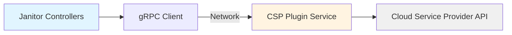

# ADR-017: Architecture — Remediation Plugins

## Context

NVSentinel has multiple `RecommendedAction` values defined in the [health event protobuf](https://github.com/NVIDIA/NVSentinel/blob/e8edbb9da9a92120d8d7b5424f8f3f74063e61c3/data-models/protobufs/health_event.proto) such as:

- `COMPONENT_RESET` - Reset GPU or other component
- `RESTART_VM` - Reboot virtual machine node
- `REPLACE_VM` - Terminate and replace virtual machine

These `RecommendedActions`'s map to a Janitor custom resource in the fault-remediation module. This creates an opinionated end-to-end remediation flow where NVSentinel can define a set of conditions that map to a given remediation.

- `COMPONENT_RESET` - ResetGPU CR
- `RESTART_VM` - RebootNode CR
- `REPLACE_VM` - TerminateNode CR

This strong coupling can let implementation of the individual actions in a workflow be delegated to an outside system (e.g. new CSPs).

Janitor currently uses an internal Go package ([`janitor/pkg/csp`](https://github.com/NVIDIA/NVSentinel/tree/e8edbb9da9a92120d8d7b5424f8f3f74063e61c3/janitor/pkg/csp)) that provides hardcoded implementations for major cloud providers (AWS, Azure, GCP, OCI). The package implements the `CSPClient` interface:

```go
type CSPClient interface {
    SendRebootSignal(ctx context.Context, node corev1.Node) (ResetSignalRequestRef, error)
    IsNodeReady(ctx context.Context, node corev1.Node, message string) (bool, error)
    SendTerminateSignal(ctx context.Context, node corev1.Node) (TerminateNodeRequestRef, error)
}
```

Controllers instantiate CSP clients directly and call methods during reconciliation loops.

This hardcoded approach has several limitations:

1. **Limited Extensibility**: End users cannot customize remediation behavior for their specific environments
2. **Provider Coverage**: We cannot anticipate every CSP provider or private cloud implementation
3. **Operational Rigidity**: Changing remediation logic requires rebuilding and redeploying Janitor

## Decision

Transform the CSP interface from an internal Go package to a **gRPC-based plugin architecture** where remediation backends run as independent services that Janitor controllers communicate with over the network.

## Implementation

### Architecture Overview

Janitor controllers will communicate with external gRPC-based plugins instead of calling cloud provider APIs directly:



This enables users to deploy their own plugin implementations with custom logic while Janitor focuses solely on Kubernetes control loops.

### Protobuf Service Definition

New protobuf definition included in `janitor/`:

```proto
service CSPPluginService {
  rpc SendRebootSignal(SendRebootSignalRequest) returns (SendRebootSignalResponse) {}
  rpc IsNodeReady(IsNodeReadyRequest) returns (IsNodeReadyResponse) {}
  rpc SendTerminateSignal(SendTerminateSignalRequest) returns (SendTerminateSignalResponse) {}
}

message SendRebootSignalRequest {
  string node_name = 1;
}

message SendRebootSignalResponse {
  string request_id = 1;
}

message IsNodeReadyRequest {
  string node_name = 1;
}

message IsNodeReadyResponse {
  bool is_ready = 1;
}

message SendTerminateSignalRequest {
  string node_name = 1;
}

message SendTerminateSignalResponse {
  string request_id = 1;
}
```

### Configuration

Janitor configuration supports plugin endpoints at global and per-controller levels:

```yaml
global:
  cspPluginHost: "csp-plugin-default.nvsentinel.svc.cluster.local:9090"

rebootNodeController:
  enabled: true
  # Optional: override with custom plugin
  cspPluginHost: "custom-reboot-plugin.acme.svc.cluster.local:9090"

terminateNodeController:
  enabled: true
  # Uses global.cspPluginHost if not specified
```

### Key Implementation Points

**Janitor Side**:
- Controllers instantiate a gRPC client from config (endpoint, timeout, etc)
- Use the codegen client from the protobuf definition for handing server calls
- Example usage in the RebootNode controller reconciler

```go
type RebootNodeReconciler struct {
  client.Client
  Scheme    *runtime.Scheme
  Config    *config.RebootNodeControllerConfig
  CSPClient protos.CSPPluginServiceClient
}

func (r *RebootNodeReconciler) Reconcile(ctx context.Context, req ctrl.Request) (ctrl.Result, error) {
  // reconiliation start omitted

  // if reboot signal not sent then:
  rsp, rebootErr := r.CSPClient.SendRebootSignal(cspCtx, &protos.SendRebootSignalRequest{NodeName: node.Name})
  if rebootErr != nil {
    return ctrl.Result{}, rebootErr
  }
  reqRef := rsp.RequestId

  // reconiliation end omitted
}

func (r *RebootNodeReconciler) SetupWithManager(mgr ctrl.Manager) error {
	grpcClient, err := grpc.NewClient("localhost:50051", grpc.WithTransportCredentials(insecure.NewCredentials()))

	r.CSPClient = protos.NewCSPPluginServiceClient(grpcClient)
	if err != nil {
		return fmt.Errorf("failed to create CSP client: %w", err)
	}

	return ctrl.NewControllerManagedBy(mgr).
		For(&janitordgxcnvidiacomv1alpha1.RebootNode{}).
		Named("rebootnode").
		Complete(r)
}
```

**Plugin Side**:
- Handle cloud provider SDK calls and any custom logic (approvals, logging, etc.)
- Deploy as separate Kubernetes Deployment/Service
- Example AWS server implementing SendRebootSignal:

```go
package main

import (
	"context"
	"fmt"
	"log"
	"net"

	"google.golang.org/grpc"
	pb "github.com/nvidia/nvsentinel/janitor/protos/v1"
)

type cspPluginServer struct {
	pb.UnimplementedCSPPluginServiceServer
}

func (s *cspPluginServer) SendRebootSignal(ctx context.Context, req *pb.SendRebootSignalRequest) (*pb.SendRebootSignalResponse, error) {
	log.Printf("Received reboot request for node: %s", req.NodeName)

	_, err = c.ec2.RebootInstances(ctx, &ec2.RebootInstancesInput{
		InstanceIds: []string{req.NodeName},
	})

	requestID := fmt.Sprintf("reboot-%s-123456", req.NodeName)
	return &pb.SendRebootSignalResponse{RequestId: requestID}, nil
}

func main() {
	lis, err := net.Listen("tcp", ":50051")
	if err != nil {
		log.Fatalf("Failed to listen: %v", err)
	}

	grpcServer := grpc.NewServer()
	pb.RegisterCSPPluginServiceServer(grpcServer, &cspPluginServer{})

	log.Printf("CSP Plugin Server listening on :50051")
	if err := grpcServer.Serve(lis); err != nil {
		log.Fatalf("Failed to serve: %v", err)
	}
}
```

**Deployment**:
- `NVIDIA/NVSentinel` will include _some_ plugin implementations for widely used CSPs which will be deployed via Helm sub-charts alongside Janitor
- Standard Kubernetes Service for network discovery

### Authentication

Plugin services need to authenticate incoming requests from Janitor to prevent unauthorized remediation actions. We'll use Kubernetes service account JWT tokens for a simple, native authentication flow:

**Client Side (Janitor)**:
- Read the mounted service account token from `/var/run/secrets/kubernetes.io/serviceaccount/token`
- Include token in gRPC metadata with each request

```go
func (r *RebootNodeReconciler) Reconcile(ctx context.Context, req ctrl.Request) (ctrl.Result, error) {
    // ...
    token, err := os.ReadFile("/var/run/secrets/kubernetes.io/serviceaccount/token")
    if err != nil {
        return ctrl.Result{}, fmt.Errorf("failed to read SA token: %w", err)
    }

    md := metadata.New(map[string]string{
        "authorization": fmt.Sprintf("Bearer %s", token),
    })
    cspCtx := metadata.NewOutgoingContext(context.Background(), md)

    rsp, err := r.CSPClient.SendRebootSignal(cspCtx, &protos.SendRebootSignalRequest{NodeName: node.Name})
    // ...
}
```

**Server Side (Plugin)**:
- Extract token from incoming gRPC metadata
- Validate token against Kubernetes API server using TokenReview API
- Verify the service account has expected identity (e.g., `system:serviceaccount:nvsentinel:janitor`)

```go
func authReq(ctx context.Context, req any, info *UnaryServerInfo, handler UnaryHandler) (any, error) {
    md, ok := metadata.FromIncomingContext(ctx)
    if !ok {
        return nil, status.Error(codes.Unauthenticated, "missing metadata")
    }

    authHeader := md.Get("authorization")
    if len(authHeader) == 0 {
        return nil, status.Error(codes.Unauthenticated, "missing authorization header")
    }

    token := strings.TrimPrefix(authHeader[0], "Bearer ")

    tr := &authenticationv1.TokenReview{
        Spec: authenticationv1.TokenReviewSpec{
            Token: token,
        },
    }

    result, err := s.k8sClient.AuthenticationV1().TokenReviews().Create(ctx, tr, metav1.CreateOptions{})
    if err != nil || !result.Status.Authenticated {
        return nil, status.Error(codes.Unauthenticated, "invalid token")
    }

    if result.Status.User.Username != "system:serviceaccount:nvsentinel:janitor" {
        return nil, status.Error(codes.PermissionDenied, "unauthorized service account")
    }

    return handler(ctx, req)
}

func main() {
	lis, err := net.Listen("tcp", ":50051")
	if err != nil {
		log.Fatalf("Failed to listen: %v", err)
	}

	grpcServer := grpc.NewServer(
    grpc.UnaryInterceptor(authReq),
  )
	pb.RegisterCSPPluginServiceServer(grpcServer, &cspPluginServer{})

	log.Printf("CSP Plugin Server listening on :50051")
	if err := grpcServer.Serve(lis); err != nil {
		log.Fatalf("Failed to serve: %v", err)
	}
}
```

**Benefits**:
- No additional secrets or credentials to manage
- Tokens automatically rotated by kubelet
- Native Kubernetes RBAC integration
- Plugins can enforce fine-grained access control based on service account identity

## Rationale

### Why gRPC?

- **Strong Contract**: Protobuf provides strongly-typed contracts with codegen compatibility
- **Language Agnostic**: End users can write plugins in any language (Go, Python, Rust, etc.)

### Why Plugin Architecture?

- **Separation of Concerns**: Janitor focuses on Kubernetes control loops; plugins handle CSP-specific logic
- **Independent Versioning**: Plugin updates don't require Janitor redeployment
- **Extensibility**: End users can inject custom workflows without forking Janitor

## Consequences

### Positive

- **Extensibility**: End users can implement custom remediation logic matching their operational requirements
- **Security**: CSP credentials isolated to plugin pods; Janitor never requires cloud provider permissions
- **Innovation**: Community can contribute plugins for new CSPs without NVSentinel maintainer review
- **Reduced Maintenance**: NVSentinel maintainers not responsible for every CSP integration

### Negative

- **Deployment Complexity**: Additional Kubernetes resources (Deployments, Services, ServiceAccounts) to manage
- **Network Dependency**: Inter-service communication introduces potential failure points

### Mitigations

- **Helm Chart Integration**: NVSentinel Helm chart will include plugin sub-charts for _some_ widely used CSPs with sensible defaults
- **Health Checks**: gRPC health check probes ensure Janitor fails fast on plugin unavailability
- **Circuit Breakers**: Implement client-side retry logic with exponential backoff for transient failures
- **Documentation**: Provide comprehensive migration guide, example custom plugins, and troubleshooting playbooks

## Alternatives Considered

### Alternative A: Keep In-Process CSP Clients

**Rejected** because:
- Does not solve the extensibility problem for end users with custom requirements
- Forces all CSP logic to be open-sourced (some enterprises have proprietary workflows)
- Increases Janitor's complexity as more CSPs are added

## Notes

## References

- [NVSentinel Health Event Protobuf](https://github.com/NVIDIA/NVSentinel/blob/e8edbb9da9a92120d8d7b5424f8f3f74063e61c3/data-models/protobufs/health_event.proto)
- [Current CSP Interface](https://github.com/NVIDIA/NVSentinel/blob/e8edbb9da9a92120d8d7b5424f8f3f74063e61c3/janitor/pkg/csp/client.go)
