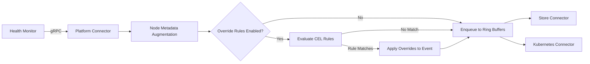

# ADR-021: Configuration — Health Event Property Overrides

## Context

When health monitors detect errors, they emit health events with properties that determine how the system responds: whether the error is fatal (`isFatal`), what action to recommend (`recommendedAction`), and so on. These events are passed to the Platform Connector, which stores them in the database and propagates them to the rest of the system.

Currently, these properties are hardcoded in each health monitor. If a monitor decides XID 109 is fatal, it's fatal everywhere. While we have CEL-based rules in fault-quarantine that let operators control *whether* to initiate breakfix actions on a node, those rules can't change the health event itself.

## Problem

Operators need a way to suppress specific errors or change recommended actions on-the-fly, without forking code or redeploying containers. Two common scenarios drive this:

#### Error suppression
You've analyzed your workloads and determined that XID 109 is benign in your environment—maybe it's a known quirk of how your training jobs run. But every time it happens, NVSentinel still marks the node as fatally unhealthy. Your end users see XID 109 in node conditions, even though nothing actually needs fixing. Even if you disable quarantine for XID 109 via CEL rules, the node still shows a scary fatal error message, confusing users who wonder why NVSentinel isn't doing anything about it.

#### Dynamic recommendation changes
During an incident or maintenance window, you need to quickly change what NVSentinel recommends. Maybe you want all GPU errors to trigger support escalation instead of automatic remediation. Or your organization has specific runbooks that don't match the default recommendations. Right now, you'd need to modify health monitor code and redeploy—too slow for operational response.

### Current Limitations

Today's workarounds fall short:

- CEL rules in fault-quarantine control *remediation* (quarantine or not) but can't change the event properties themselves
- You can skip quarantine, but the node still shows a fatal error - the disconnect confuses users
- There's no way to change `recommendedAction` through configuration; it's baked into each monitor's code

## Decision

We'll add a CEL-based override system in the Platform Connector. Operators define rules using CEL expressions to match specific health events and override properties `isFatal`, `isHealthy`, and `recommendedAction`. The overrides happen early — after metadata augmentation but before events hit storage or Kubernetes—so the modified properties are what everyone sees: the database, node conditions, events, external tools, everything.

## Implementation

### Architecture



### Configuration Structure

Configuration in Helm values uses CEL expressions:

```yaml
platformConnector:
  healthEventOverrides:
    enabled: true
    rules:
      # Suppress XID 109 - known to be non-critical in this environment
      - name: "suppress-xid-109"
        when: |
          event.agent == "syslog-health-monitor" && 
          "109" in event.errorCode
        override:
          isFatal: false          # Suppress: mark as non-fatal
          recommendedAction: NONE # No action needed
```

### CEL Evaluation

- Each rule's `when` expression is evaluated against the health event
- Rules are evaluated in order; first rule where `when` evaluates to `true` wins
- If no rule matches, the health event is unchanged
- CEL expressions have access to the `event` object with all health event fields
- Expressions are compiled once at startup and cached for evaluation performance
- Startup validation ensures all CEL expressions are syntactically valid
- Invalid expressions cause Platform Connector to fail startup (fail-fast)


### Key Components

#### Package Structure

`platform-connectors/pkg/overrides/`

#### Go Types

```go
type Config struct {
    Enabled bool   `json:"enabled"`
    Rules   []Rule `json:"rules"`
}

type Rule struct {
    Name     string   `json:"name"`              // Human-readable rule name for debugging
    When     string   `json:"when"`              // CEL expression
    Override Override `json:"override"`
}

type Override struct {
    IsFatal           *bool                 `json:"isFatal,omitempty"`
    IsHealthy         *bool                 `json:"isHealthy,omitempty"`
    RecommendedAction *pb.RecommendedAction `json:"recommendedAction,omitempty"`
}
```

#### Processor Interface

```go
type Processor interface {
    ApplyOverrides(event *pb.HealthEvent)
}
```

#### Integration

Platform Connector server receives events, augments with node metadata first, then applies overrides before ring buffer enqueue. Processor field added to `PlatformConnectorServer` struct.

Order of operations:
1. Receive health event via gRPC
2. Augment with node metadata (labels, provider info)
3. Apply override rules (if enabled)
4. Enqueue to ring buffers for storage and Kubernetes propagation

#### Helm Configuration

Added to `values.yaml` under `platformConnector.healthEventOverrides` with `enabled` flag and `rules` array. ConfigMap template includes JSON serialization of override config.

#### Observability

Prometheus metrics track overrides applied and evaluated. Logs record each override application with event details.

## Rationale

### Why CEL?

- **Flexibility**: Operators can express complex matching logic without code changes
- **Type safety**: Compile-time validation catches errors at startup

### Why Platform Connector?

- **Early interception**: Overrides applied before storage and Kubernetes propagation ensures consistency across all downstream consumers
- **Centralized**: Single point of configuration for all health monitors - change once, affects everything
- **Metadata access**: Overrides applied after metadata augmentation enables node-based matching (e.g., zone-specific, instance-type-specific overrides)

## Consequences

### Positive
- Suppress errors and adjust recommendations via configuration (no code/redeployment)
- Fast operational response (incidents, maintenance, workload tuning)
- Consistent across all consumers (database, K8s, exporters)

### Negative
- Added configuration complexity
- Risk of hiding critical errors
- Harder debugging (modified vs original properties)

### Mitigations

- Startup validation (fail fast on invalid config)
- Full observability (logs, metrics, original values in metadata)
- Clear documentation with warnings

## Alternatives Considered

### 1. Simple Match Pattern (Field-Based)

Use declarative field matching instead of CEL expressions:

```yaml
rules:
  - match:
      agent: "syslog-health-monitor"
      errorCode: ["109"]
    override:
      isFatal: false
```

Rejected: 
- Limited to exact field matches (can't express "all GPU errors" or "any fatal event")
- Hard to extend for complex logic (OR conditions, numeric comparisons, label matching)
- Would need custom DSL features added incrementally, reinventing CEL
- Inconsistent with fault-quarantine's CEL-based rules

### 2. Health Monitor Level Overrides

Implement override logic directly in each health monitor before emitting events. Each monitor would read its own override configuration and apply transformations before sending to Platform Connector.

Rejected: 
- Code changes required in every health monitor (GPU, CSP, Syslog, K8s Object)
- Decentralized configuration - operators must configure overrides in 4+ different places
- Inconsistent implementations (GPU is Python, others Go)
- Maintenance burden - bug fixes replicated across monitors


## Notes

- Scope: Only `isFatal`, `isHealthy`, and `recommendedAction` are overridable in v1
- CEL expressions have access to all health event fields plus node metadata (labels, provider info)
- First match wins: Rules evaluated in order; first matching rule applies
- Opt-in: Feature disabled by default; requires explicit configuration

## Testing

- Unit: CEL expression compilation, evaluation, override application, first-match-wins behavior, invalid expression handling
- Integration: End-to-end override in platform connector, database/K8s verification, metrics, complex CEL expressions
- E2E: Configure via Helm, trigger events, verify overridden properties across system, label-based matching after metadata augmentation
- Performance: Benchmark CEL evaluation overhead on high-volume event streams

## References

- [GitHub Issue #462](https://github.com/NVIDIA/NVSentinel/issues/462) - Original feature request
- [ADR-003: Rule-Based Node Quarantine](./003-rule-based-node-quarantine.md)