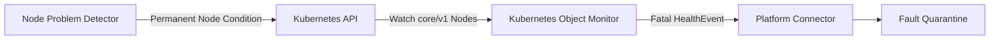

# ADR-053: Monitoring — Integrate Default NPD Node Conditions

## Context

[Kubernetes node-problem-detector (NPD)](https://github.com/kubernetes/node-problem-detector)
makes node-level kernel, filesystem, hardware, runtime, networking, and service
problems visible to the Kubernetes control plane. Its supplied checks provide a
reference set of general node-health signals that can be assessed alongside
NVSentinel's existing checks.

NPD normally runs on every node, either as a DaemonSet or a host service. Each
NPD process loads one or more monitor configurations and detects problems in
three ways:

- passively matching kernel, journald, or file logs;
- actively executing health-check scripts or binaries; and
- periodically collecting host statistics and exposing them as metrics.

A detected problem is converted into an internal status and sent to NPD's
Kubernetes exporter.

### NPD monitors

Each NPD configuration file creates an instance of one of three monitor
implementations:

- **`SystemLogMonitor`:** Passively collects entries from `/dev/kmsg`,
  journald, or regular log files. It applies configured regular expressions to
  detect kernel, filesystem, hardware, container-runtime, service, crash, and
  security messages. Matches can produce temporary Events, permanent Node
  Conditions, and problem counters or gauges.
- **`CustomPluginMonitor`:** Actively executes configured scripts or binaries
  on a schedule. It is used for service health probes, restart-frequency
  counters, NTP, DNS, conntrack, iptables-mode, and other checks that require
  commands rather than passive log matching. Exit code `0` means healthy, `1`
  means unhealthy, and any other value means unknown. Results can update
  Events, Conditions, and problem metrics.
- **`SystemStatsMonitor`:** Periodically collects host telemetry through its
  CPU, memory, disk, host, network, and OS-feature collectors. Examples include
  CPU load and usage, runnable or blocked processes, memory usage, disk
  capacity and I/O, host statistics, and network errors or drops. It records
  metrics only; it does not publish problem Events or Node Conditions.

### Check types

NPD does not model fatality. The `type` configured on each rule determines how
the monitor represents a detected result:

- A **temporary** rule represents an occurrence rather than an ongoing state.
  When it matches or fails, the monitor adds a Warning Event to its status
  update. The Kubernetes exporter records the Event against the Node. A later
  healthy observation does not clear the historical Event.
- A **permanent** rule represents a state that should remain visible. The
  monitor updates the configured Node Condition and emits a Kubernetes Event
  associated with the Node when the condition changes. Transitioning into the
  problem produces a Warning Event; transitioning back to healthy produces a
  Normal Event.

Reporting happens after detection: the monitor creates an internal status, the
NPD core forwards it, and the Kubernetes exporter writes the Event or Node
Condition. From the definition and behaviour, we can map permanent as fatal events and temporary as non-fatal events.

**Note:** Permanent Node Conditions set by `SystemLogMonitor` do not clear automatically
when the underlying problem is resolved. These rules detect failure by matching
a log entry, but they have no recovery probe that can confirm recovery and set
the condition to `False`. The condition therefore remains `True` for the
lifetime of the NPD process.

Restarting the NPD Pod or service resets the conditions owned by that process,
but a resulting `False` value is not proof of recovery. NPD can also process
recent matching entries during startup, so a failure log inside its configured
lookback window can immediately set the condition to `True` again.

## Decision

Integrate the following permanent Node Conditions that are enabled by default
in the upstream NPD configuration:

- `XfsShutdown`
- `CperHardwareErrorFatal`
- `ReadonlyFilesystem`

Kubernetes Object Monitor (KOM) watches each condition on `core/v1/Node`. When
a condition becomes `True` with its expected reason, KOM emits a fatal
`HealthEvent` whose recommended action is `REPLACE_VM`.

Each check uses a distinct `NPD`-prefixed policy name and error code so that
simultaneous faults remain independently visible. This ADR covers upstream NPD
checks only. Provider-specific and pre-baked NPD configurations are outside the
scope of this rollout.

All other NPD checks are outside the scope of this integration. They are
temporary occurrences that require correlation, Docker-specific,
Windows-specific, metrics-only, or already covered by Kubernetes-native Node
health and existing remediation.

## Implementation

### Check inventory

| Check | Description | NPD monitor | Type | Rationale | Action |
| --- | --- | --- | --- | --- | --- |
| `XfsShutdown` | Matches the kernel message emitted when XFS forcibly shuts down a filesystem after a serious metadata, journal, or storage error. Normal I/O to the affected mount fails until the underlying problem is repaired and the filesystem is recovered. | `SystemLogMonitor` | Permanent | A storage failure can make the node unusable. | `REPLACE_VM` |
| `CperHardwareErrorFatal` | Matches a UEFI Common Platform Error Record whose firmware-reported severity is `fatal`. The record can represent an uncorrectable CPU, memory, PCIe, motherboard, or other platform-hardware failure. | `SystemLogMonitor` | Permanent | Adds fatal platform-hardware coverage beyond GPU-specific signals. The full CPER is required to identify the component and distinguish a current failure from a BERT record. | `REPLACE_VM` |
| `ReadonlyFilesystem` | Detects a kernel message stating that a filesystem was remounted read-only, usually to limit damage after an error. Writes fail for consumers of that mount and can affect the whole node when root, kubelet, or runtime storage is involved. | `SystemLogMonitor` | Permanent | Detects a generic filesystem failure that directly blocks writes. | `REPLACE_VM` |

### Architecture



### KOM policies

Provide the following policies through the opt-in
[NPD remediation values](../../distros/kubernetes/nvsentinel/values-npd-remediation.yaml):

- `NPDXfsShutdown`
- `NPDCperHardwareErrorFatal`
- `NPDReadonlyFilesystem`

They are intentionally excluded from the default KOM values. NVSentinel does
not install or configure NPD, and an operator might already have different
ownership or remediation rules for NPD conditions.

Each policy:

- watches `core/v1/Node`;
- matches its source condition when `status == "True"` and the expected reason
  is present;
- sets `isFatal: true`;
- uses `recommendedAction: REPLACE_VM`;
- uses a distinct check name and error code; and
- keeps identity fields stable between unhealthy and healthy HealthEvents.

The `XfsShutdown` policy is:

```yaml
- name: NPDXfsShutdown
  enabled: true
  resource:
    group: ""
    version: v1
    kind: Node
  predicate:
    expression: |
      resource.status.conditions.exists(c,
        c.type == "XfsShutdown" &&
        c.status == "True" &&
        c.reason == "XfsHasShutdown")
  healthEvent:
    componentClass: Node
    isFatal: true
    message: "NPD reported an XFS filesystem shutdown"
    recommendedAction: REPLACE_VM
    errorCode:
      - NPD_XFS_SHUTDOWN
```

The fatal CPER policy is:

```yaml
- name: NPDCperHardwareErrorFatal
  enabled: true
  resource:
    group: ""
    version: v1
    kind: Node
  predicate:
    expression: |
      resource.status.conditions.exists(c,
        c.type == "CperHardwareErrorFatal" &&
        c.status == "True" &&
        c.reason == "CperHardwareErrorFatal")
  healthEvent:
    componentClass: Node
    isFatal: true
    message: "NPD reported a fatal CPER hardware error"
    recommendedAction: REPLACE_VM
    errorCode:
      - NPD_CPER_HARDWARE_ERROR_FATAL
```

The read-only filesystem policy is:

```yaml
- name: NPDReadonlyFilesystem
  enabled: true
  resource:
    group: ""
    version: v1
    kind: Node
  predicate:
    expression: |
      resource.status.conditions.exists(c,
        c.type == "ReadonlyFilesystem" &&
        c.status == "True" &&
        c.reason == "FilesystemIsReadOnly")
  healthEvent:
    componentClass: Node
    isFatal: true
    message: "NPD reported a read-only filesystem"
    recommendedAction: REPLACE_VM
    errorCode:
      - NPD_READONLY_FILESYSTEM
```

## Rationale

- The selected checks are available as permanent Node Conditions in the
  upstream default NPD configuration, so KOM can consume them without a new
  event-ingestion or correlation path.
- The conditions identify failures severe enough to make a node or its storage
  unsafe for workloads.
- Separate policy names and error codes preserve the identity of simultaneous
  failures throughout the NVSentinel pipeline.

## Consequences

### Positive

- NVSentinel gains generic filesystem and fatal platform-hardware coverage in
  addition to its existing health checks.
- The integration reuses KOM's existing Node watch and health-event publishing
  path.

### Negative

- A `SystemLogMonitor` permanent condition remains latched after the underlying
  failure is repaired.
- Restarting NPD resets its conditions. KOM can interpret that reset as a
  healthy transition and cancel an active break-fix pipeline even when recovery
  has not been validated.

### Mitigations

- Restart NPD only after remediation has completed and recovery has been
  independently validated.
- Do not interpret a post-restart `False` condition as proof that the original
  fault is resolved. Restarting NPD clears its previously published Node
  Conditions, but the underlying host issue may still be present.
- Check the NPD startup lookback window and relevant host logs before clearing
  or cancelling remediation.

## References

- [Node Problem Detector](https://github.com/kubernetes/node-problem-detector)
- [Kubernetes Object Monitor configuration](../configuration/kubernetes-object-monitor.md)
- [Opt-in NPD remediation values](../../distros/kubernetes/nvsentinel/values-npd-remediation.yaml)
- [ADR-011: Kubernetes Object Monitor](011-kubernetes-object-monitor.md)
