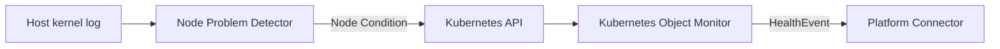

# Tutorial: Integrating Node Problem Detector

This tutorial installs Kubernetes
[node-problem-detector (NPD)](https://github.com/kubernetes/node-problem-detector),
configures NVSentinel to watch selected NPD Node Conditions, and validates the
integration.

By the end you will have:

- NPD running on each Linux node and monitoring kernel messages.
- Kubernetes Object Monitor (KOM) watching the opt-in `XfsShutdown`,
  `CperHardwareErrorFatal`, and `ReadonlyFilesystem` NPD conditions.
- A safe procedure for validating NPD detection and KOM publication.
- A pattern for monitoring additional Node Conditions from a custom NPD
  configuration.

> **Who is this for?** Cluster administrators who run NVSentinel and want to
> consume permanent Node Conditions produced by NPD.

> **Safety:** The opt-in NPD policies recommend `REPLACE_VM`. Validate them
> only in a non-production cluster or while downstream quarantine and
> remediation components are disabled. Inject test messages only on a
> disposable node with no running jobs.

## Prerequisites

- Kubernetes 1.25 or later
- Helm 3 and `kubectl`.
- Cluster-admin access to install a privileged DaemonSet and patch Node status.
- Shell or SSH access to at least one disposable Linux node for end-to-end
  validation.
- An NVSentinel release that contains the NPD KOM policies.

See the [NVSentinel Helm chart guide](../../distros/kubernetes/README.md) for
the complete NVSentinel prerequisites.

---

## 1. Understand the integration

NPD detects a host problem and publishes a permanent condition in
`Node.status.conditions`. KOM watches the Node and publishes a fatal
NVSentinel `HealthEvent` when the condition type, status, and reason match a
configured policy.



This integration watches these condition and reason pairs:

| Condition type | Problem reason | KOM policy | Action |
| --- | --- | --- | --- |
| `XfsShutdown` | `XfsHasShutdown` | `NPDXfsShutdown` | `REPLACE_VM` |
| `CperHardwareErrorFatal` | `CperHardwareErrorFatal` | `NPDCperHardwareErrorFatal` | `REPLACE_VM` |
| `ReadonlyFilesystem` | `FilesystemIsReadOnly` | `NPDReadonlyFilesystem` | `REPLACE_VM` |

These three policies are provided in a separate opt-in overlay because their
conditions are enabled by default in the upstream NPD configuration and have
approved NVSentinel actions. KOM is not limited to these conditions. If a
custom NPD configuration publishes another permanent Node Condition, add a KOM
policy for its condition type, status, and reason as shown in
[Configure a custom NPD Node Condition](#configure-a-custom-npd-node-condition).

For the design rationale and limitations, see
[ADR-053](../designs/053-npd-checks-integration.md).

---

## 2. Check for an existing NPD DaemonSet

This tutorial covers NPD deployed as a Kubernetes DaemonSet. Some managed
Kubernetes providers run NPD as a host service instead; follow the provider's
documentation for those installations. Do not install a second copy because
multiple NPD instances can compete to own the same Node Conditions.

Check for a Kubernetes installation:

```bash
kubectl get daemonsets,pods --all-namespaces | grep node-problem-detector
# Expected when NPD is installed:
# <namespace>   daemonset.apps/<daemonset-name>   <desired>   <current>   <ready>   ...
# <namespace>   pod/<pod-name>                    1/1         Running     ...
```

If NPD is already installed, verify that it loads the upstream
`kernel-monitor.json` and `readonly-monitor.json` definitions, then skip to
[Configure NVSentinel](#4-configure-nvsentinel-and-kom-policies). Provider-supplied
configurations can differ from upstream defaults, so confirm that they define
all three condition and reason pairs listed above.

---

## 3. Install NPD

Follow the upstream
[NPD installation guide](https://github.com/kubernetes/node-problem-detector#installation)
for the installation method appropriate to your cluster. NVSentinel does not
install, configure, or manage NPD.

Before continuing, confirm that the NPD installation:

- runs on every node that NVSentinel should monitor;
- loads the upstream `kernel-monitor.json` and `readonly-monitor.json`
  definitions;

For a DaemonSet installation, use the namespace and DaemonSet name selected
during installation. Derive its pod selector, check that its desired and ready
counts match, and list the nodes running its pods:

```bash
NPD_NAMESPACE="<npd-namespace>"
NPD_DAEMONSET="<npd-daemonset-name>"

NPD_SELECTOR=$(kubectl get daemonset "$NPD_DAEMONSET" \
  --namespace "$NPD_NAMESPACE" \
  -o go-template='{{range $key, $value := .spec.selector.matchLabels}}{{printf "%s=%s," $key $value}}{{end}}')
NPD_SELECTOR=${NPD_SELECTOR%,}

kubectl get daemonset "$NPD_DAEMONSET" \
  --namespace "$NPD_NAMESPACE" \
  -o custom-columns=DESIRED:.status.desiredNumberScheduled,READY:.status.numberReady
# Expected:
# DESIRED   READY
# <eligible-node-count>   <same-count>

kubectl get pods --namespace "$NPD_NAMESPACE" \
  --selector "$NPD_SELECTOR" \
  -o 'custom-columns=NAME:.metadata.name,NODE:.spec.nodeName,READY:.status.containerStatuses[0].ready'
# Expected: one row per eligible node, with READY=true
# NAME                         NODE          READY
# node-problem-detector-<id>   <node-name>   true
```
---

## 4. Configure NVSentinel and KOM policies

NPD policies are intentionally excluded from the default KOM values because
NVSentinel does not install NPD or control how an operator handles its
conditions. The repository provides an explicit
[NPD remediation overlay](../../distros/kubernetes/nvsentinel/values-npd-remediation.yaml)
for clusters where NVSentinel should own these conditions.

Download or copy `values-npd-remediation.yaml` and use it as the values file.
It enables KOM, retains the default `node-not-ready` policy, and adds the three
supported NPD policies.

### Configure a custom NPD Node Condition

NPD can publish additional permanent Node Conditions from custom monitor
configurations. Once NPD publishes a condition, add a matching policy to the
existing `kubernetes-object-monitor.policies` list in your copy of
`values-npd-remediation.yaml`.

For example, suppose a custom NPD monitor publishes:

```yaml
type: ReadOnlyRootFileSystem
status: "True"
reason: RootFileSystemIsReadOnly
```

Add this policy to the existing list:

```yaml
- name: NPDReadOnlyRootFileSystem
  enabled: true
  resource:
    group: ""
    version: v1
    kind: Node
  predicate:
    expression: |
      resource.status.conditions.exists(c,
        c.type == "ReadOnlyRootFileSystem" &&
        c.status == "True" &&
        c.reason == "RootFileSystemIsReadOnly")
  healthEvent:
    componentClass: Node
    isFatal: true
    message: "NPD reported that the root filesystem is read-only"
    recommendedAction: CONTACT_SUPPORT
    errorCode:
      - NPD_READ_ONLY_ROOT_FILESYSTEM
```

For custom condition policies:

- Use a stable, unique policy name; it becomes the HealthEvent `checkName`.
- Match the exact condition type and reason emitted by the custom NPD monitor.
- Assign a unique error code and validate the policy in a non-production
  cluster before enabling downstream remediation.
- Have NPD set the same condition to `False` only after recovery is validated.

See [KOM policy configuration](../configuration/kubernetes-object-monitor.md)
for more CEL expression examples.

### Install or upgrade NVSentinel

For a new NVSentinel installation:

```bash
NVSENTINEL_VERSION="<release-containing-the-NPD-policies>"

helm install nvsentinel oci://ghcr.io/nvidia/nvsentinel \
  --version "$NVSENTINEL_VERSION" \
  --namespace nvsentinel \
  --create-namespace \
  --values values-npd-remediation.yaml \
  --wait
```

For an existing NVSentinel installation, preserve its current user-supplied
values and add this overlay:

```bash
NVSENTINEL_VERSION="<release-containing-the-NPD-policies>"

helm upgrade nvsentinel oci://ghcr.io/nvidia/nvsentinel \
  --version "$NVSENTINEL_VERSION" \
  --namespace nvsentinel \
  --reuse-values \
  --values values-npd-remediation.yaml \
  --wait
```

Verify KOM:

```bash
kubectl rollout status deployment/kubernetes-object-monitor \
  --namespace nvsentinel \
  --timeout=5m
# Expected:
# deployment "kubernetes-object-monitor" successfully rolled out
```

---

## 5. Validate the integration

There are two useful levels of validation:

1. Patch a Node Condition to validate KOM independently of NPD.
2. Inject a synthetic kernel message to validate NPD and KOM end to end.

Both methods publish a synthetic fatal HealthEvent. Before continuing, confirm
that this is a non-production cluster or that downstream quarantine, drain, and
remediation components are disabled.

### Validate KOM with a patched condition

Choose a disposable node and patch one source condition:

```bash
NODE="<node-name>"
NOW=$(date -u +"%Y-%m-%dT%H:%M:%SZ")

kubectl patch node "$NODE" --subresource=status --type=strategic \
  -p "{\"status\":{\"conditions\":[{
    \"type\":\"XfsShutdown\",
    \"status\":\"True\",
    \"reason\":\"XfsHasShutdown\",
    \"message\":\"Synthetic XFS shutdown for KOM validation\",
    \"lastHeartbeatTime\":\"$NOW\",
    \"lastTransitionTime\":\"$NOW\"
  }]}}"
# Expected:
# node/<node-name> patched
```

Confirm the source condition:

```bash
kubectl get node "$NODE" \
  -o jsonpath='{range .status.conditions[?(@.type=="XfsShutdown")]}{.type}={.status}{" reason="}{.reason}{"\n"}{end}'
# Expected:
# XfsShutdown=True reason=XfsHasShutdown
```

Confirm KOM matched and published the policy:

```bash
kubectl logs deployment/kubernetes-object-monitor \
  --namespace nvsentinel \
  --since=5m |
  grep NPDXfsShutdown
# Expected: a "Publishing health event" entry containing NPDXfsShutdown
```

Set the synthetic condition to `False` after the test:

```bash
NOW=$(date -u +"%Y-%m-%dT%H:%M:%SZ")

kubectl patch node "$NODE" --subresource=status --type=strategic \
  -p "{\"status\":{\"conditions\":[{
    \"type\":\"XfsShutdown\",
    \"status\":\"False\",
    \"reason\":\"XfsHasNotShutDown\",
    \"message\":\"Synthetic XFS shutdown test cleared\",
    \"lastHeartbeatTime\":\"$NOW\",
    \"lastTransitionTime\":\"$NOW\"
  }]}}"
# Expected:
# node/<node-name> patched
```

### Validate NPD and KOM end to end

The upstream NPD
[Try It Out guide](https://github.com/kubernetes/node-problem-detector#try-it-out)
documents injecting synthetic messages into the kernel message stream when
testing rules. This does not damage the filesystem or hardware, but it creates
real NPD conditions. Run only one test at a time.

SSH to the disposable node selected above and inject one of these messages:

```bash
# XfsShutdown
sudo sh -c \
  "echo 'kernel: XFS (test): Shutting down filesystem' >> /dev/kmsg"

# CperHardwareErrorFatal
sudo sh -c \
  "echo 'kernel: mce: [Hardware Error]: event severity: fatal' >> /dev/kmsg"

# ReadonlyFilesystem
sudo sh -c \
  "echo 'kernel: EXT4-fs (test): Remounting filesystem read-only' >> /dev/kmsg"
```

From your workstation, inspect the resulting source conditions:

```bash
kubectl get node "$NODE" \
  -o jsonpath='{range .status.conditions[*]}{.type}={.status}{" reason="}{.reason}{"\n"}{end}' |
  grep -E 'XfsShutdown|CperHardwareErrorFatal|ReadonlyFilesystem'
# Expected for the messages that were injected:
# XfsShutdown=True reason=XfsHasShutdown
# CperHardwareErrorFatal=True reason=CperHardwareErrorFatal
# ReadonlyFilesystem=True reason=FilesystemIsReadOnly
```

Confirm that KOM published each matched policy:

```bash
kubectl logs deployment/kubernetes-object-monitor \
  --namespace nvsentinel \
  --since=10m |
  grep -E 'NPDXfsShutdown|NPDCperHardwareErrorFatal|NPDReadonlyFilesystem'
# Expected: one "Publishing health event" entry for each injected condition
```

`SystemLogMonitor` permanent conditions are latched. Injected messages remain
eligible during the default five-minute lookback, so wait at least five minutes
after the final injection before restarting NPD. Do not restart the DaemonSet:
that restarts NPD on every eligible node and resets all process-owned
conditions. Delete only the NPD pod scheduled on the tested node, then wait for
its replacement. Reuse `NPD_NAMESPACE` and `NPD_SELECTOR` from step 3:

```bash
NPD_POD=$(kubectl get pods \
  --namespace "$NPD_NAMESPACE" \
  --selector "$NPD_SELECTOR" \
  --field-selector "spec.nodeName=$NODE" \
  -o jsonpath='{.items[0].metadata.name}')

kubectl delete pod "$NPD_POD" --namespace "$NPD_NAMESPACE"
# Expected:
# pod "<old-npd-pod>" deleted

kubectl wait --for=create pod \
  --namespace "$NPD_NAMESPACE" \
  --selector "$NPD_SELECTOR" \
  --field-selector "spec.nodeName=$NODE" \
  --timeout=2m
# Expected:
# pod/<new-npd-pod> created
```

A `False` condition after restart only shows that the NPD process reset its
state; it does not prove recovery from a real failure. Restarting NPD can also
cause KOM to observe a healthy transition and cancel active break-fix
processing, so limit this procedure to the test node after validation.

---

## Troubleshooting

### NPD does not publish the source condition

- Confirm `/dev/kmsg` is mounted in the NPD pod.
- Confirm the process loads `kernel-monitor.json` and
  `readonly-monitor.json`.
- Confirm the injected message contains the `kernel: ` prefix and exactly
  matches the expected capitalization.

```bash
kubectl logs "daemonset/$NPD_DAEMONSET" --namespace "$NPD_NAMESPACE"
# Expected when healthy: NPD starts without monitor configuration or
# /dev/kmsg access errors.
```

### KOM does not publish a HealthEvent

- Confirm `global.kubernetesObjectMonitor.enabled: true`.
- Confirm the relevant policy has `enabled: true`.
- Compare the Node Condition type, status, and reason with the CEL predicate.

```bash
kubectl logs deployment/kubernetes-object-monitor --namespace nvsentinel
# Expected when healthy: "Loaded policy configuration",
# "Registered controller", and "Starting manager" entries.
```

### A source condition remains `True`

This is expected for permanent conditions produced by `SystemLogMonitor`.
Validate remediation, allow the monitor lookback window to expire, and then
restart NPD. Never use an NPD restart alone as proof that the host recovered.

## References

- [ADR-053: Integrate Default NPD Node Conditions](../designs/053-npd-checks-integration.md)
- [Kubernetes Object Monitor configuration](../configuration/kubernetes-object-monitor.md)
- [Opt-in NPD remediation values](../../distros/kubernetes/nvsentinel/values-npd-remediation.yaml)
- [Node Problem Detector](https://github.com/kubernetes/node-problem-detector)
