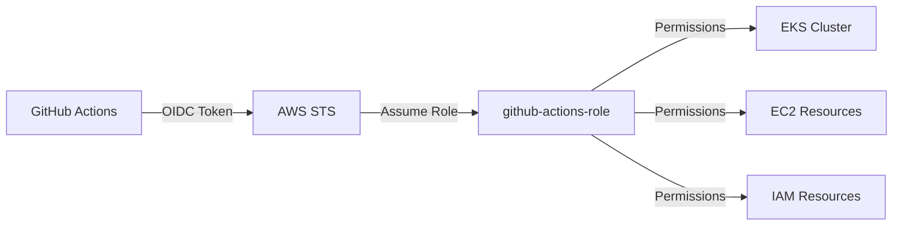

# AWS Account OIDC Setup for GitHub Actions

This Terraform configuration sets up AWS IAM OIDC federation for GitHub Actions, enabling secure authentication without long-lived credentials for NVSentinel integration testing.

## Prerequisites

- [Terraform](https://www.terraform.io/downloads.html) >= 1.9.5
- [AWS CLI](https://docs.aws.amazon.com/cli/latest/userguide/install-cliv2.html) configured with administrative credentials
- AWS account with permissions to create IAM roles, policies, and OIDC providers
- Access to the `NVIDIA/NVSentinel` GitHub repository

## What This Creates

- **OIDC Identity Provider**: Configures GitHub (`token.actions.githubusercontent.com`) as a trusted identity provider
- **IAM Role**: `github-actions-role` with comprehensive permissions for EKS cluster lifecycle management
- **IAM Policy**: Extensive permissions for EKS, EC2, IAM, Auto Scaling, and CloudFormation services
- **Trust Relationship**: Secure access limited to `NVIDIA/NVSentinel` repository from any branch or pull request

## Architecture



## Usage

1. **Initialize Terraform:**
   ```bash
   terraform init
   ```

2. **Configure variables (optional):**
   ```bash
   cp terraform.tfvars.example terraform.tfvars
   # Edit terraform.tfvars with your values
   ```

3. **Preview changes:**
   ```bash
   terraform plan
   ```

4. **Create the resources:**
   ```bash
   terraform apply
   ```

5. **Note the outputs** for use in GitHub Actions:
   ```bash
   terraform output
   ```

## Configuration Variables

| Variable | Description | Default |
|----------|-------------|---------|
| `aws_region` | AWS region for resources | `us-west-2` |
| `git_repo` | GitHub repository (format: owner/repo) | `NVIDIA/NVSentinel` |
| `github_actions_role_name` | Name for the IAM role | `github-actions-role` |
| `oidc_provider_url` | GitHub OIDC provider URL | `https://token.actions.githubusercontent.com` |
| `oidc_audience` | OIDC audience | `sts.amazonaws.com` |

## Permissions Granted

The GitHub Actions role includes comprehensive permissions for:

### Core EKS Operations
- **EKS Clusters**: Create, delete, describe, update, and tag EKS clusters
- **EKS Node Groups**: Full lifecycle management of managed node groups
- **EKS Add-ons**: Install and manage cluster add-ons

### Supporting AWS Services
- **EC2**: VPC, subnet, security group, route table, and instance management
- **IAM**: Create and manage service roles and instance profiles for EKS
- **Auto Scaling**: Manage auto scaling groups for EKS node groups
- **CloudFormation**: EKS cluster creation uses CloudFormation stacks
- **STS**: Token operations and role assumption

### Specific Use Case
- Designed for **integration testing** workflows that create temporary EKS clusters
- Supports **GPU node groups** with specialized instance types (p5.48xlarge, etc.)
- Enables **full cluster lifecycle** including creation, testing, and cleanup

## GitHub Actions Integration

After applying this Terraform configuration, update your GitHub Actions workflow:

### 1. Get Terraform Outputs
```bash
# After terraform apply, note these values:
terraform output github_actions_role_arn
terraform output oidc_provider_arn
terraform output aws_account_id
```

### 2. Update GitHub Actions Workflow
```yaml
# Example: .github/workflows/integration-aws.yml
permissions:
  contents: read
  actions: read
  id-token: write  # Required for OIDC

jobs:
  integration-test-aws:
    runs-on: ubuntu-latest
    env:
      AWS_ACCOUNT_ID: "12345678910"  # From terraform output
      AWS_REGION: "us-east-1"
      GITHUB_ACTIONS_ROLE_ARN: "arn:aws:iam::12345678910:role/github-actions-role"
      
    steps:
      - name: Configure AWS credentials
        uses: aws-actions/configure-aws-credentials@e3dd6a429d7300a6a4c196c26e071d42e0343502  # v4.0.2
        with:
          role-to-assume: ${{ env.GITHUB_ACTIONS_ROLE_ARN }}
          aws-region: ${{ env.AWS_REGION }}
          role-session-name: GitHubActions-NVSentinel-Integration
          
      - name: Verify AWS Authentication
        run: |
          aws sts get-caller-identity
          aws eks list-clusters --region ${{ env.AWS_REGION }}
```

### 3. Environment Variables
Update the workflow environment variables with your actual account values:
- Replace `AWS_ACCOUNT_ID` with your AWS account ID
- Replace `GITHUB_ACTIONS_ROLE_ARN` with the actual role ARN from Terraform output
- Ensure `AWS_REGION` matches your deployment region

## Security Features

- **No long-lived credentials**: Uses OIDC tokens for temporary, scoped access
- **Repository-scoped**: Only allows access from `NVIDIA/NVSentinel` repository
- **Branch flexibility**: Works with any branch, pull request, or tag from the repository
- **Time-limited sessions**: AWS credentials automatically expire after session timeout
- **Audit trail**: All actions logged in AWS CloudTrail with GitHub context

## Trust Policy Details

The OIDC trust policy configuration:

### Allowed Access Patterns
- ✅ `repo:NVIDIA/NVSentinel:ref:refs/heads/main` (main branch)
- ✅ `repo:NVIDIA/NVSentinel:ref:refs/heads/feature/*` (feature branches)
- ✅ `repo:NVIDIA/NVSentinel:pull_request` (pull requests)  
- ✅ `repo:NVIDIA/NVSentinel:ref:refs/tags/*` (tagged releases)

### Security Restrictions
- ❌ Other repositories (`repo:NVIDIA/other-repo:*`)
- ❌ Other organizations (`repo:other-org/NVSentinel:*`)
- ❌ Direct API access (requires OIDC token from GitHub Actions)

### Trust Policy Configuration
```hcl
condition {
  test     = "StringEquals"
  variable = "token.actions.githubusercontent.com:aud"
  values   = ["sts.amazonaws.com"]
}

condition {
  test     = "StringLike" 
  variable = "token.actions.githubusercontent.com:sub"
  values   = ["repo:NVIDIA/NVSentinel:*"]
}
```## Cleanup

To remove all resources:
```bash
terraform destroy
```

## Outputs

After successful deployment, Terraform provides these outputs:

```bash
terraform output
```

| Output | Description | Usage |
|--------|-------------|--------|
| `github_actions_role_arn` | ARN of the GitHub Actions IAM role | Use in workflow `role-to-assume` |
| `oidc_provider_arn` | ARN of the GitHub OIDC provider | Reference for trust relationships |
| `aws_account_id` | AWS account ID | Use in workflow environment variables |
| `github_actions_role_name` | Name of the IAM role | For AWS CLI operations |

## Troubleshooting

### Common Issues

1. **OIDC Provider already exists**:
   ```bash
   # Import existing provider instead of creating new one
   terraform import aws_iam_openid_connect_provider.github \
     arn:aws:iam::YOUR-ACCOUNT-ID:oidc-provider/token.actions.githubusercontent.com
   ```

2. **GitHub Actions authentication failure** (`Not authorized to perform sts:AssumeRoleWithWebIdentity`):
   - Verify the repository name matches exactly in `terraform.tfvars`
   - Check that workflow is running from correct repository
   - Ensure `permissions.id-token: write` is set in workflow

3. **Permission denied during Terraform apply**:
   ```bash
   # Ensure your AWS credentials have these permissions:
   aws iam list-roles  # Test IAM access
   aws sts get-caller-identity  # Verify current user
   ```

4. **Invalid OIDC thumbprint**:
   - Thumbprints are pre-configured for GitHub Actions
   - If GitHub updates their certificates, update `thumbprint_list` in `federation.tf`

### Debugging GitHub Actions OIDC

Enable debug logging in your workflow:
```yaml
env:
  ACTIONS_STEP_DEBUG: true
  ACTIONS_RUNNER_DEBUG: true
```

Check the OIDC token claims:
```bash
# In your workflow, decode the token (for debugging only)
echo $ACTIONS_ID_TOKEN_REQUEST_TOKEN | base64 -d
```

## Validation

After deployment, verify the setup:

```bash
# 1. Check OIDC provider exists
aws iam get-open-id-connect-provider \
  --open-id-connect-provider-arn "arn:aws:iam::$(aws sts get-caller-identity --query Account --output text):oidc-provider/token.actions.githubusercontent.com"

# 2. Verify role exists  
aws iam get-role --role-name github-actions-role

# 3. Check role trust policy
aws iam get-role --role-name github-actions-role \
  --query 'Role.AssumeRolePolicyDocument' --output json

# 4. List attached policies
aws iam list-attached-role-policies --role-name github-actions-role
```

## Integration with NVSentinel

This setup enables the NVSentinel integration testing workflow:

1. **Cluster Creation**: GitHub Actions can create temporary EKS clusters for testing
2. **GPU Support**: Includes permissions for GPU-enabled node groups
3. **Testing Environment**: Isolated AWS resources for each test run
4. **Cleanup**: Full permissions to tear down resources after testing

The role is specifically designed for the `.github/workflows/integration-aws.yml` workflow in the NVSentinel repository.

## References

- [AWS IAM OIDC Documentation](https://docs.aws.amazon.com/IAM/latest/UserGuide/id_roles_providers_create_oidc.html)
- [GitHub Actions OIDC](https://docs.github.com/en/actions/deployment/security-hardening-your-deployments/about-security-hardening-with-openid-connect)
- [AWS Configure Credentials Action](https://github.com/aws-actions/configure-aws-credentials)
- [EKS User Guide](https://docs.aws.amazon.com/eks/latest/userguide/)
- [GitHub OIDC Thumbprints](https://github.blog/changelog/2023-06-27-github-actions-update-on-oidc-integration-with-aws/)